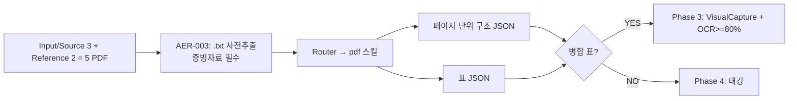

# Phase 1 — Act: Phase 2 진입 트리거

## Phase 1 결과 요약
- 게이트 7/7 PASS (`check.md`)
- 4-질문 프레임워크 확정 (`prompt_analysis.md` Section 5-2)
- 입력 5개 PDF 확인

## Phase 2 입력 계약

## Phase 2 산출 경로
- `Projects/260415_document_analyzer/docs/pdca/phase2/{plan,do,check,act}.md`
- `Projects/260415_document_analyzer/Output/Reports/captures/` (Phase 3 사전 폴더)
- 페이지 JSON: 임시 `.bkit/runtime/document_analyzer/pages/*.json` (선택)

## 트리거
즉시 `Phase 2 plan.md` 작성 후 파싱 진입.
