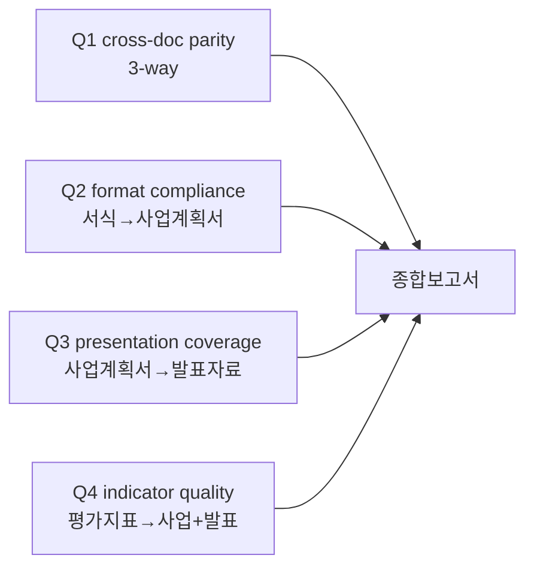

# Phase 1 — Check: 기준 확보 게이트 통과 검증

## 검증 시각
2026-04-15 KST (Phase 1 본체 완료)

## 게이트 통과 조건 (refined MD 지시 #2)

| # | 조건 | 결과 | 증거 |
|---|------|------|------|
| 1 | `Input/Reference/` 비어있지 않음 | PASS | 평가지표.pdf (0.89MB) + 작성서식.pdf (1.97MB) |
| 2 | `Input/Source/` 비어있지 않음 | PASS | 사업계획서.pdf (2.94MB) + 증빙자료.pdf (13.10MB) + 발표자료.pdf (0.91MB) |
| 3 | 사용자 결정 4종 확보 (Q1~Q4) | PASS | `docs/prompt_analysis.md` Section 5 |
| 4 | Tier 결정 | PASS | Dynamic 7-Layer |
| 5 | 보고서 양식 결정 | PASS | 기본 (현황·문제점·개선책) |
| 6 | 분석 질문 정의 (4개) | PASS | `docs/prompt_analysis.md` Section 5-2 |
| 7 | source_hash anchored prompt_analysis 존재 | PASS | `docs/prompt_analysis.md` 헤더에 hash 박힘 |

## 7 / 7 PASS → Phase 2 진입 가능

## 4-질문 프레임워크 확정

## 입력 파일 형식 확인

5개 모두 PDF. 라우터는 `pdf` 스킬로 단일 분기. 50p 초과 가능성(증빙자료 13MB) → AER-003 적용: `.txt` 사전 추출 필수.

## Phase 2 진입 트리거

다음 단계: `Phase 2 (파싱 라우팅)` — 5개 PDF를 페이지 단위 구조 JSON + 표 JSON으로 변환.
