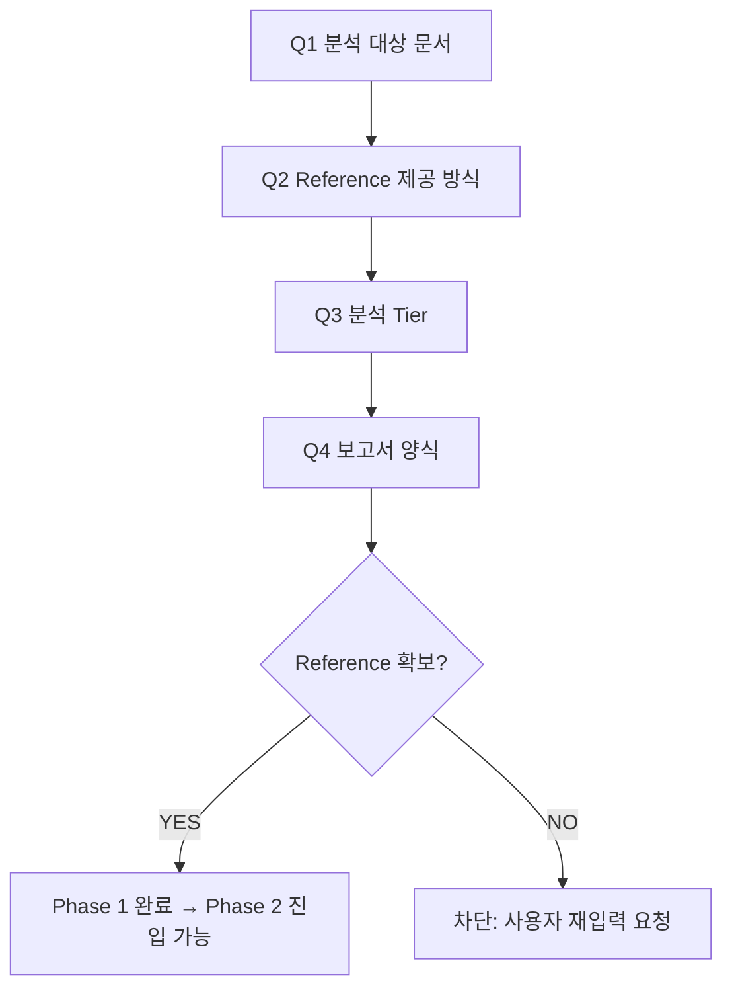

# Phase 1 — Plan: 기준 확보 + 사용자 결정

## 목표
Reference 비어 있으면 Phase 2 진입 차단(refined MD 지시 #2). Tier·보고서 양식 결정.

## 입력
- 사용자 응답 (AskUserQuestion 4항목)
- `Input/Source/` 현황 (현재 비어있음)
- `Input/Reference/` 현황 (현재 비어있음)

## 처리 순서

## 결정 항목

| # | 질문 | 옵션 |
|---|------|------|
| Q1 | 분석 대상 문서 | (a) 즉시 업로드 (b) 샘플 자동 생성 (c) 기존 사용자 자료 폴더 경로 지정 |
| Q2 | Reference 제공 방식 | (a) 파일 업로드 (b) 즉석 체크리스트 정의 (c) 유사 문서 자동 참조 |
| Q3 | 분석 Tier | Starter / Dynamic / Enterprise |
| Q4 | 보고서 양식 | 기본 / 사용자 양식 첨부 |

## 산출물
- `Input/Reference/` 채움
- `docs/pdca/phase1/check.md` (완료 검증)
- `docs/pdca/phase1/act.md` (Phase 2 트리거)
