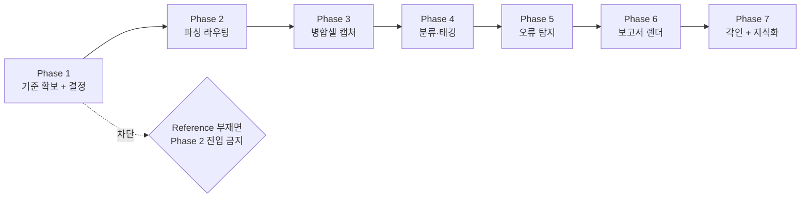
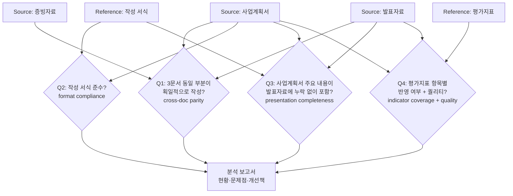

# Prompt Analysis — document_analyzer

Source: refined
Source Hash: 7cfaec51171a52370d366def02db026eeabdf926eea84fbc93f7d22a616d9c44
Refined MD Path: Temporary Storage/ImprovementPrompt/260415_1439_refined_document_analyzer.md
Generated: 2026-04-15 KST
Schema: IMP-042 prompt-swap-detection

> 이 문서는 refined MD의 Section 9 "개선된 지시문" 10개 항목을 분해해
> Phase 1~7 실행 입력으로 변환한 결과다. 본문 어디든 위 Source Hash가 박혀 있어야
> `main_gate.js`가 통과시킨다(눈속임 방지).

---

## 1. 분해된 지시 (Section 9 → 명령/제약/입력/출력)

| # | 명령 | 제약 (객관 기준) | 입력 | 출력 |
|---|------|------------------|------|------|
| 1 | 프로젝트 초기화 | 위치=`Projects/260415_document_analyzer/`, 슬러그=`document_analyzer` | refined MD | 폴더 트리 (본 문서 작성 시점에 완료) |
| 2 | 분석 기준 확보 | `Input/Reference/`가 비었으면 Phase 2 진입 차단 | 사용자 응답 (AskUserQuestion) | Reference 파일 N>=1 또는 즉석 정의 MD |
| 3 | 파서 라우팅 | HWP/HWPX→`HWPX_Master`, DOC/DOCX/PPTX→`DocKit`, PDF→`pdf`(50p 초과 시 .txt 사전 추출 AER-003) | `Input/Source/*` | 페이지별 구조 JSON + 표 JSON |
| 4 | 병합셀 캡쳐 | 병합수>=2 OR 중첩 깊이>=2 → `VisualCapture`, OCR 신뢰도>=80% | 표 JSON + 페이지 PDF/HWPX 렌더 | 캡쳐 PNG + OCR JSON + 신뢰도 메타 |
| 5 | 세분 분류 + 태깅 | 페이지당 분석 레코드>=1, 표/그림당 캡쳐>=1, 단원/챕터/대주제 태그 + Mermaid 연계 그래프 | 페이지 JSON 전체 | 태그 인덱스 + 연계 그래프 MD |
| 6 | 7레이어 오류 탐지 | 문장/문단/문맥/단원/챕터/장/전체 검토, 값 불일치 + 주제 일관성 + 연계 누락 | 태그 인덱스 + 원본 | 이슈 리스트 JSON |
| 7 | 보고서 산출 | `Output/Reports/YYMMDD_HHMM_{source}_분석보고서.md` (현황+문제점+개선책), `Output/Errors/YYMMDD_HHMM_{source}_오류정정표.md` (별도 취합) | 이슈 리스트 + 태그 인덱스 | MD 보고서 2종 |
| 8 | 프레임워크 적용 | `development-pipeline` 9-phase + `pdca`, 에러 `auto-error-recovery` 최대 3회, 각인 `harness-imprint` | 모든 단계 | PDCA MD + 각인 |
| 9 | 지식 저장 | `llm-wiki` 3-layer + `term-organizer` 용어사전 | 도메인 용어 | 위키 엔트리 + 용어사전 갱신 |
| 10 | 4대 기법 준수 | 모든 산출 MD에 Mermaid + 예제 + 테이블/구조도 + 기능 활용 명시 | 산출 MD 전체 | 기법 준수 산출물 |

---

## 2. 입출력 계약

### 입력 계약
| 종류 | 경로 | 필수 형식 | 검증 |
|------|------|-----------|------|
| 분석 대상 | `Input/Source/*.{hwp,hwpx,doc,docx,pdf}` | 확장자 매치 | 파서 라우터가 반려 |
| 분석 기준 | `Input/Reference/*.{md,xlsx,pdf,docx}` | 사용자 정의 또는 즉석 체크리스트 MD | Phase 1 완료 게이트 |
| 사용자 결정 | AskUserQuestion 응답 | Tier + 보고서 양식 | Phase 1 완료 게이트 |

### 출력 계약
| 종류 | 경로 | 형식 |
|------|------|------|
| 분석 보고서 | `Output/Reports/{YYMMDD}_{HHMM}_{source}_분석보고서.md` | 4대 기법 준수 MD |
| 오류 정정표 | `Output/Errors/{YYMMDD}_{HHMM}_{source}_오류정정표.md` | 표 형식 + 정정 코드 블록 |
| 정제 사본 | `Output/MakingPrompt/{refined_md}` | 본 시점 1건 배치 완료 |
| 캡쳐 산출물 | `Output/Reports/captures/{source}_p{N}_t{M}.png` | PNG + sidecar JSON |
| PDCA 로그 | `docs/pdca/{phase}/{plan|do|check|act}.md` | bkit 템플릿 |

---

## 3. 기능 사용 매핑 (refined MD Section 3 → Phase별)

| Phase | 사용 스킬 | 사용 MCP | 사용 훅 |
|-------|----------|---------|---------|
| 1. 기준 확보 | (없음) | sequential-thinking | main_gate (검증) |
| 2. 파싱 | HWPX_Master, DocKit, pdf | token-optimizer | pre-tool-guard |
| 3. 캡쳐 결합 | VisualCapture, pdf | fal-ai (선택) | post-tool-validate |
| 4. 분류·태깅 | Mermaid_FlowChart, term-organizer | memory | navigator-updater |
| 5. 오류 탐지 | code-review (메타), zero-script-qa | sequential-thinking | imprint-on-error |
| 6. 보고 | mdGuide, FileNameMaking, bkit-templates | token-optimizer | post-tool-validate |
| 7. 각인·지식화 | harness-imprint, llm-wiki | memory | session-stop |

---

## 4. Phase 분할 (실행 순서)

각 Phase 완료 시 `docs/pdca/phase{N}/check.md` 작성, 모든 산출 MD는 4대 기법 준수.

---

## 5. 사용자 결정 (Phase 1 답변 — 2026-04-15 KST)

| # | 결정 | 답변 |
|---|------|------|
| Q1 | 분석 대상 문서 | (사용자 직접 배치) `Input/Source/` 3종 PDF: 사업계획서·증빙자료·발표자료 (순천제일대학교 2026년 AID 전환 중점 전문대학 지원사업) |
| Q2 | Reference 제공 방식 | (사용자 직접 배치) `Input/Reference/` 2종 PDF: 평가지표 + 사업계획서 작성 서식(붙임2) |
| Q3 | 분석 Tier | **Dynamic 7-Layer** (표준) |
| Q4 | 보고서 양식 | **기본 템플릿** (현황·문제점·개선책) |

### 5-1. 실제 입력 파일 (확인됨)

| 역할 | 파일명 | 형식 | 크기 |
|------|--------|------|------|
| Source-사업계획서 | `2026년 AID 전환 중점 전문대학 지원사업 사업계획서_순천제일대학교.pdf` | PDF | 2.94 MB |
| Source-증빙자료 | `2026년 AID 전환 중점 전문대학 지원사업 증빙자료_순천제일대학교.pdf` | PDF | 13.10 MB |
| Source-발표자료 | `AID 전환 중점 전문대학 지원사업 발표 자료(순천제일대+조선이공대).pdf` | PDF | 0.91 MB |
| Reference-평가지표 | `평가지표.pdf` | PDF | 0.89 MB |
| Reference-작성서식 | `붙임2. 2026년 AID 전환 중점 전문대학 지원사업 사업계획서 작성 서식.pdf` | PDF | 1.97 MB |

### 5-2. 4대 분석 질문 (프로젝트 본체 정의)

Source 3종 + Reference 2종을 입력으로 다음 4개 질문에 답하는 분석보고서를 산출한다.

| Q | 질문 | 비교 축 | 7-Layer 적용 |
|---|------|---------|--------------|
| Q1 | 사업계획서·증빙자료·발표자료가 동일 부분이 획일적으로 작성되었는가 | Source 3-way 교차 | 문장/문단/문맥/단원/챕터/장/전체 — 값 불일치·주제 일관성 |
| Q2 | 작성 서식(작성 방법)에 맞추어 사업계획서가 잘 작성되었는가 | Reference(서식) → Source(사업계획서) | 단원/챕터/장 — 형식·항목 누락 |
| Q3 | 사업계획서 주요 내용이 발표자료에 모두 포함되어 누락 없는가 | Source(사업계획서) → Source(발표자료) | 단원/대주제 — 연계 누락 |
| Q4 | 평가지표 기준 사업계획서·발표자료가 모든 사항 반영했는가 + 퀄리티 | Reference(평가지표) → Source(사업계획서+발표자료) | 전체 — 지표별 충족도·근거 인용 |

### 5-3. 산출물 갱신

| 파일 | 형식 | Q 매핑 |
|------|------|--------|
| `Output/Reports/{YYMMDD}_{HHMM}_cross_consistency_분석보고서.md` | 4대 기법 MD | Q1 |
| `Output/Reports/{YYMMDD}_{HHMM}_format_compliance_분석보고서.md` | 4대 기법 MD | Q2 |
| `Output/Reports/{YYMMDD}_{HHMM}_presentation_coverage_분석보고서.md` | 4대 기법 MD | Q3 |
| `Output/Reports/{YYMMDD}_{HHMM}_indicator_quality_분석보고서.md` | 4대 기법 MD | Q4 |
| `Output/Reports/{YYMMDD}_{HHMM}_종합_분석보고서.md` | 통합 MD | Q1~Q4 요약 + 우선순위 개선책 |
| `Output/Errors/{YYMMDD}_{HHMM}_오류정정표.md` | 표 + 정정 코드 | 4축 전체 이슈 취합 |

---

## 6. 무결성 자가 점검

| 항목 | 결과 |
|------|------|
| Source: refined 명시 | OK |
| Source Hash 본문 포함 | OK (위 헤더) |
| Refined MD 경로 명시 | OK |
| Section 9 10개 항목 모두 매핑 | OK (Section 1 표) |
| 4대 기법 준수 (이 문서 자체) | Mermaid 1 + 표 6 + 분해 분석 + 기능 매핑 — OK |
