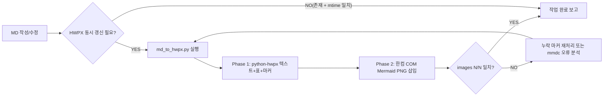

# Report Format v2 — 서술형 본문 표준

> 작성일: 2026-04-15 / 적용 대상: `Output/Reports/*.md`, `Output/Errors/*.md`

## 1. 형식 원칙

| 항목 | v1 (구) | v2 (신) |
|------|---------|---------|
| 본문 | 표·체크리스트 위주 | **서술형 한국어 단락** (사람이 읽어 이해 가능) |
| 페이지 표기 | 시퀀스(파일 N번째) | **인쇄 페이지** 우선, 시퀀스는 괄호로 보조 |
| 근거 | 항목식 나열 | 문장 안에 직접 인용 + 페이지 명시 |
| 표/체크리스트 | 본문 대체 | 본문 보조 (요약·매트릭스 한정) |
| 플로우차트 | 선택 | **유지** (Mermaid, 사용자 선호) |
| 작성 검증 | 자유 | **거짓 작성 금지** — 직접 확인하지 않은 사실 기재 금지 |

## 2. 페이지 번호 기준 (IMP-044 적용)

> 페이지의 기준은 AI가 읽어들이는 한 장 한 장의 실제 시퀀스가 아니라, 해당 장수를 보았을 때 문서에 표기되어 있는 페이지를 기준으로 한다.
> 표지·요약·챕터 시작·목차 등은 인쇄 쪽수에서 제외되어 표기되기 때문이다.

문서별 표기 규칙:

| 문서 | 인쇄 시작 | offset | 본문 표기 형식 |
|------|----------|--------|----------------|
| 사업계획서 (plan) | 시퀀스 11 = 인쇄 1 | 10 | `계획서 p.25 (seq 35)` |
| 증빙자료 (evidence) | 시퀀스 3 = 인쇄 1 | 2 | `증빙 p.12 (seq 14)` |
| 발표자료 (pres) | 인쇄 번호 없음 | - | `발표 슬라이드 1` |
| 평가지표 (indicator) | 단일 면 | - | `지표 1면` |
| 작성서식 (format) | 인쇄 번호 없음 | - | `서식 seq 5` (괄호 없이 시퀀스 직표기) |

자동 매핑 출처: `.bkit_runtime/page_mapping.json` (`detect_print_pages.py` 산출)

## 3. 서술형 본문 작성 패턴 (예시)

### 3-1. 권장 패턴 — 작성방법 ↔ 실제 비교

> 작성방법은 "실적과 명확한 체계를 제시하라"고 명시하였으나(서식 seq 5), 계획서 p.25 (seq 35)에는 실적이 첨부되어 있다고 본문에 기술되어 있는 반면, 실제 증빙자료 p.12 (seq 14)를 직접 확인한 결과 해당 실적이 사업 영역과 직접 관련이 없는 항목으로 첨부되어 있어 정합성이 결여되어 있다.

문단 구성 요소:
1. **요구사항 인용** (출처 페이지 명시)
2. **계획서 주장** (출처 페이지 명시)
3. **직접 확인한 사실** (증빙·발표 페이지 명시)
4. **불일치/일치 판단** (HIGH/MEDIUM/LOW 등급)

### 3-2. 보조 도구 (본문 보조용, 본문 대체 금지)

- **Mermaid 플로우차트**: 4-축 분석 흐름, PDCA 단계, 정정 우선순위 등 시각화
- **Mermaid 관계도**: 서로 연관된 파일, 챕터, 장, 단락 등을 Mermaid 도형과 화살표 등으로 시각화
- **요약 표**: 등급별 정정 항목 카운트, 점수 매트릭스 등 한눈에 비교 가능한 데이터
- **체크리스트**: 충족/불충족 마킹이 명확한 양식 항목 한정

## 4. 거짓 작성 금지 (IMP-045 적용)

- 모든 사실 진술은 **직접 PDF를 읽어 확인한 내용**만 기재
- "추정", "보임" 등 추측 표현은 사용 가능하나 **사실 단정 금지**
- 페이지를 인용할 때는 **반드시 직독 후 인용**
- 불확실하면 **"확인 불가"**로 명기 후 다음 단계 권고

## 5. 보고서 구조 템플릿

```markdown
# {제목}

> 분석일: 2026-04-15 / 분석 축: Q{N} {축 이름}

## 1. 분석 흐름 (Mermaid 플로우차트)

\`\`\`mermaid
flowchart TD
  ...
\`\`\`

## 2. 핵심 발견 — 서술

(서술형 단락 N개, 각 단락은 패턴 3-1 준수)

## 3. 정정 권고 (요약 표)

| ID | 등급 | 위치 | 정정 방향 |
|----|------|------|-----------|
| ... | HIGH | 계획서 p.25 (seq 35) | ... |

## 4. 직독 검증 로그

(본 보고서 작성을 위해 실제 직독한 페이지 목록 — 검증 가능성 확보)
- 계획서 p.1 (seq 11) — 사업 목표
- 증빙 p.12 (seq 14) — 실적 N건
- ...
```

## 6. v1 → v2 마이그레이션 절차

1. v1 파일을 `_v1_backup/`으로 복사 (이미 완료)
2. v2 표준에 따라 신규 작성 (덮어쓰기)
3. 파일명 변경: `260415_1700_*` (v2 시간 prefix)
4. HWPX 재변환은 `src/renderers/md_to_hwpx.py` 그대로 사용

## 7. HWPX 산출 — 보고서 작업의 마지막 단계 (필수, IMP-046 적용)

> **모든 분석 보고서 작업은 MD 작성으로 끝나지 않는다. HWPX 산출이 최종 단계다.**

### 7-1. 강제 원칙

- `Output/Reports/*.md` 또는 `Output/Errors/*.md` 신규 작성·수정 후, 동일 stem의 HWPX가 `Output/Reports_HWPX/`·`Output/Errors_HWPX/`에 존재하지 않거나 MD보다 mtime이 오래된 경우 **작업 미완료**로 간주한다.
- "보고서 작성 완료" 보고는 HWPX 산출 후에만 가능. MD만 산출하고 종료 시 하네스 위반.

### 7-2. 변환 명령 (표준)

```bash
# 디렉토리 일괄
python src/renderers/md_to_hwpx.py \
  --md   Output/Reports \
  --out  Output/Reports_HWPX \
  --mmd-dir .bkit_runtime/mmd \
  --png-dir .bkit_runtime/png

python src/renderers/md_to_hwpx.py \
  --md   Output/Errors \
  --out  Output/Errors_HWPX \
  --mmd-dir .bkit_runtime/mmd \
  --png-dir .bkit_runtime/png

# 단일 파일
python src/renderers/md_to_hwpx.py \
  --md   Output/Reports/260415_1700_종합_분석보고서.md \
  --out  Output/Reports_HWPX/260415_1700_종합_분석보고서.hwpx \
  --mmd-dir .bkit_runtime/mmd --png-dir .bkit_runtime/png
```

### 7-3. 산출 검증 체크리스트

- [ ] `*.hwpx` 파일이 같은 stem으로 존재
- [ ] `[OK] ... (images: N/N)` 로그에서 분자 = 분모 (모든 Mermaid 삽입 성공)
- [ ] HWPX mtime ≥ MD mtime
- [ ] 한컴 COM(`HWPFrame.HwpObject`)이 정상 종료(Phase 2 완료)

### 7-4. 갱신 워크플로우 (Mermaid)



### 7-5. 예외

- `_v1_backup/` 하위 파일은 HWPX 재변환 면제 (이력 보존용)
- `docs/`·`README.md` 등 본 보고서 외 문서는 적용 면제
- 변환 실패 시 사용자에게 구체적 오류 보고 후 정지 (자동 무시 금지)
