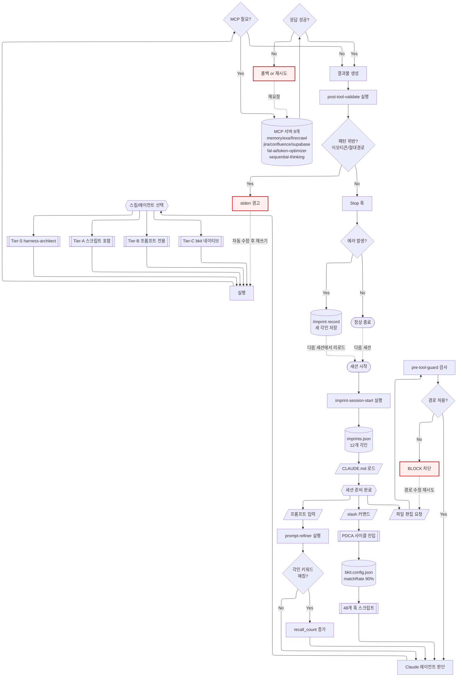
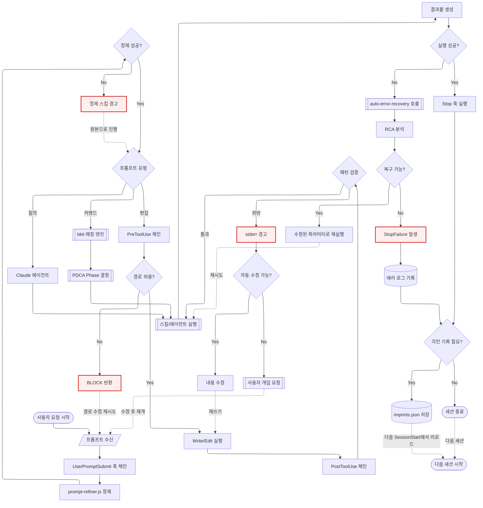
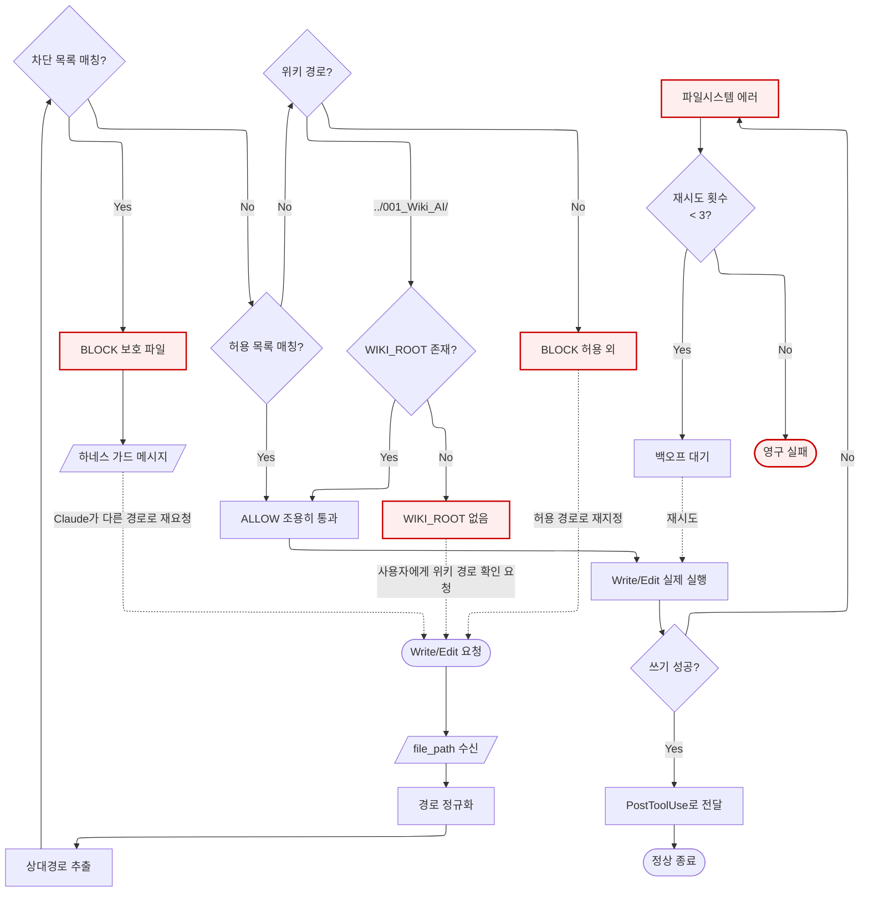
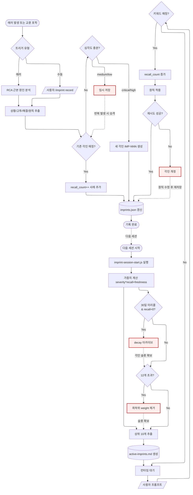
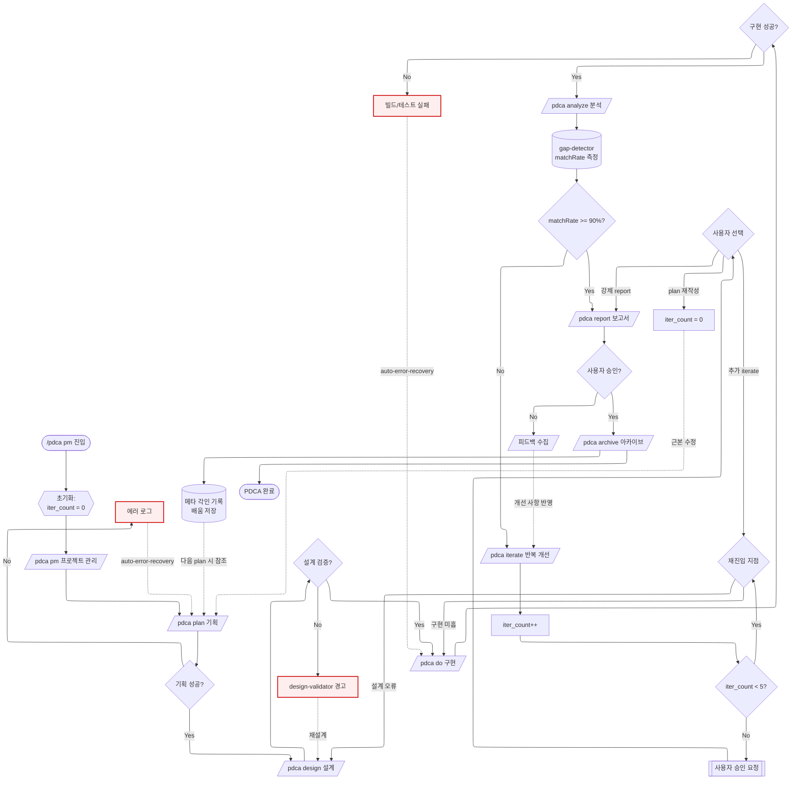
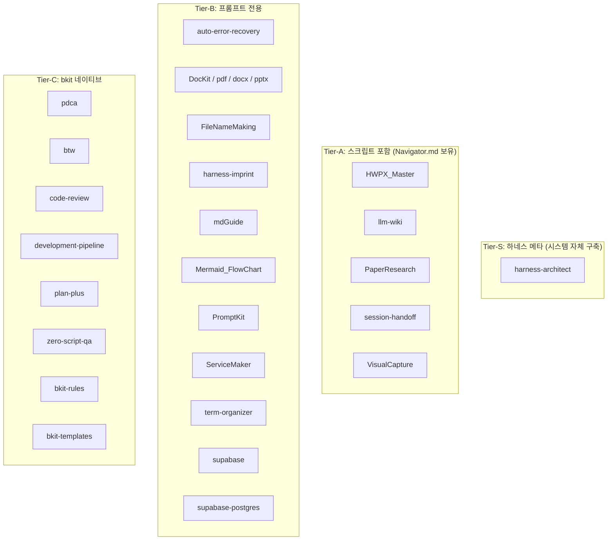
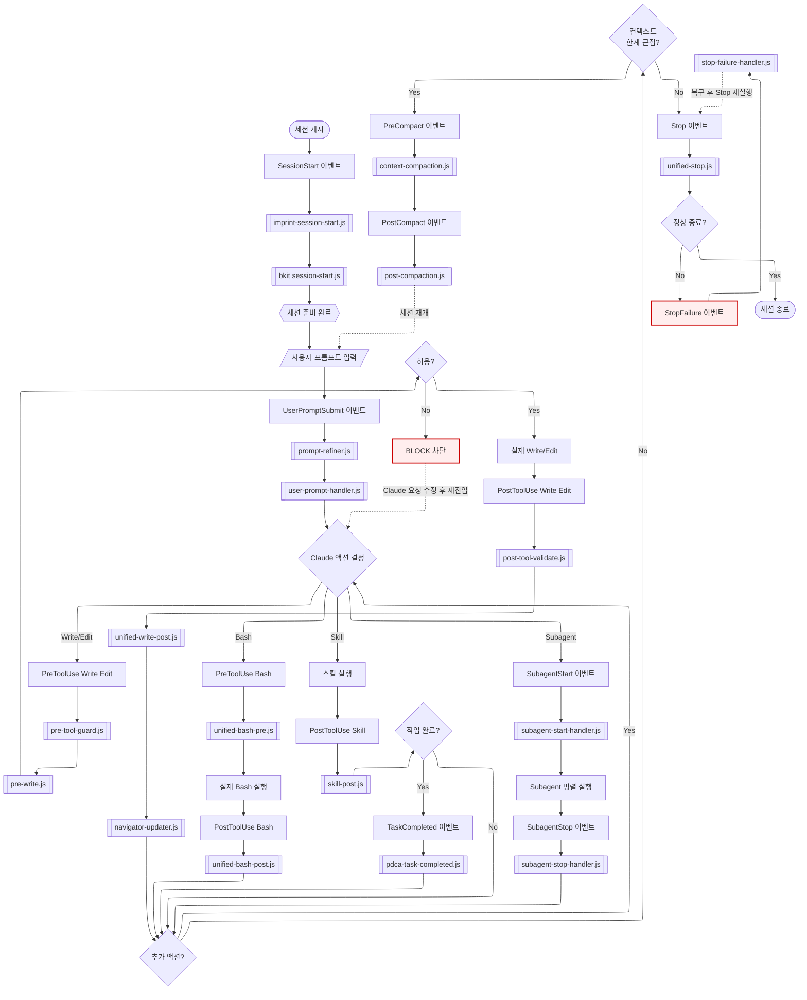
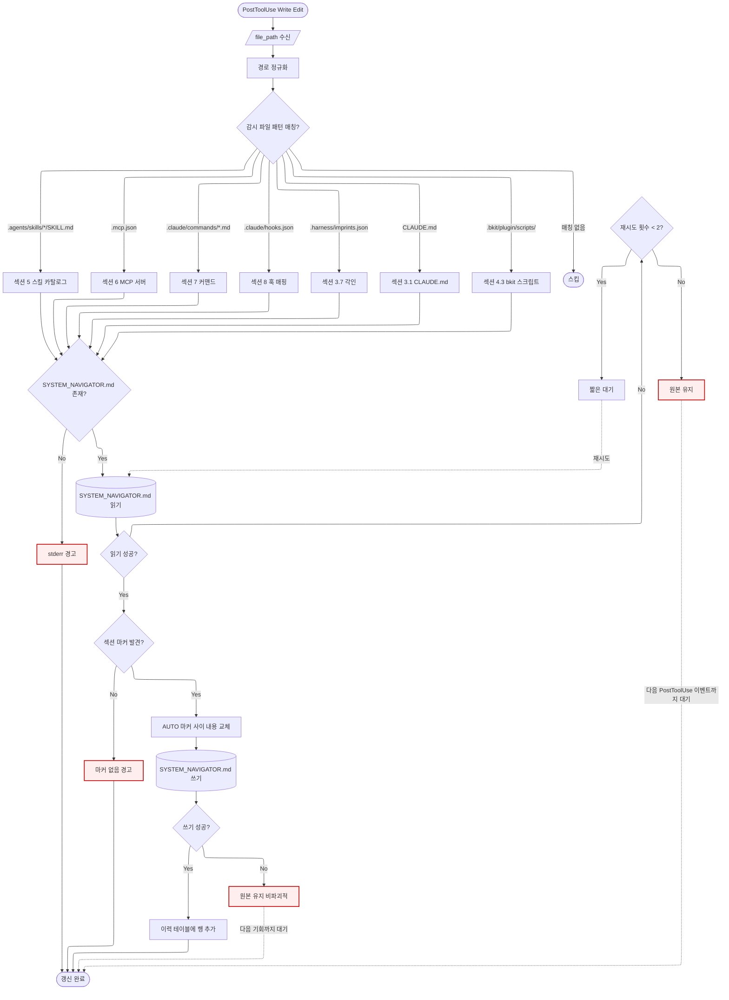

# SYSTEM_NAVIGATOR -- 005_AI_Project 시스템 네비게이터

> 최종 갱신: 2026-04-10 | 자동 갱신 훅: navigator-updater.js (PostToolUse)

---

## 0. 범례 + 사용법 {#범례--사용법}

### 문서 구조

이 문서는 005_AI_Project의 전체 시스템을 **체계도**(Hierarchy)와 **흐름도**(Flowchart)로 문서화한다.

### 상태 표시

| 표시 | 의미 |
|------|------|
| **[작동]** | 정상 작동 중 |
| **[부분]** | 기능 정의됨, 일부만 작동 |
| **[미작동]** | 정의됨, 실제 동작하지 않음 |
| **[미구현]** | 계획만 있고 구현되지 않음 |

### 네비게이션

- 각 섹션 제목 클릭으로 이동
- `[맨 위로]` 링크로 이 섹션 복귀
- `<details>` 접기 영역 클릭으로 상세 내용 확인

### 자동 갱신 마커

`<!-- AUTO:section-id:START -->` ~ `<!-- AUTO:section-id:END -->` 구간은 `navigator-updater.js` 훅이 자동 갱신한다.

**자동 갱신 마커 목록 (12개)**:

| 마커 ID | 트리거 파일 | Reader | 섹션 |
|---------|------------|--------|------|
| `skills-catalog` | `.agents/skills/*/SKILL.md` | `readSkillsCatalog` | §5.2 |
| `mcp-servers` | `.mcp.json` | `readMcpServers` | §6 |
| `commands` | `.claude/commands/*.md` | `readCommands` | §7.1 |
| `imprints` | `.harness/imprints.json` | `readImprints` | §3.7 |
| `pre-tool-guard` | `.claude/hooks/pre-tool-guard.js` | `readPreToolGuard` | §3.2 |
| `bkit-scripts` | `.bkit/plugin/scripts/` | `readBkitScripts` | §4.3 |
| **`navigators-meta`** | **`.agents/skills/*/Navigator.md`** | **`readNavigatorsMeta`** | **§5.3 (신규)** |
| **`pattern-stats`** | **(동상)** | **`readPatternStats`** | **§5.4 (신규)** |
| **`gap-analysis`** | **(동상)** | **`readGapAnalysis`** | **§9.1 (신규)** |
| **`navigator-diagram`** | **(동상)** | **`readNavigatorDiagram`** | **§1.2 (신규)** |
| `section-id` | (예시 placeholder) | -- | §10 |
| (암묵적) 갱신 이력 | -- | `appendHistory` | §11 |

> **Option C 신규 (2026-04-11)**: Navigator 메타 자동 집계 4 마커 추가. 14 Navigator 변경 시 동시 갱신.

---

## 1. 시스템 전체 체계도 {#시스템-전체-체계도}

### 1.1 3계층 아키텍처



<details><summary><strong>블럭 바로가기 (다이어그램 클릭 대안)</strong></summary>

[세션 시작](#harness-imprint-session) · [imprint-session-start](#harness-imprint-session) · [imprints.json](#harness-imprints) · [CLAUDE.md](#harness-claude-md) · [프롬프트 입력](#node-user-prompt) · [slash 커맨드](#node-user-slash) · [파일 편집 요청](#node-user-edit) · [prompt-refiner](#harness-prompt-refiner) · [각인 키워드 매칭](#node-d1-imprint-match) · [recall_count 증가](#node-d1-recall-count) · [Claude 에이전트 판단](#node-d1-claude-judge) · [PDCA 사이클](#bkit-pdca) · [bkit.config](#bkit-config) · [48개 훅 스크립트](#bkit-scripts) · [pre-tool-guard](#harness-pre-tool-guard) · [경로 허용 체크](#node-d1-path-check) · [BLOCK 차단](#node-d1-block) · [스킬/에이전트 선택](#스킬-계층) · [Tier-S](#node-d1-tier-s) · [Tier-A](#node-d1-tier-a) · [Tier-B](#node-d1-tier-b) · [Tier-C](#node-d1-tier-c) · [실행](#node-d1-exec) · [MCP 필요 확인](#node-d1-mcp-need) · [MCP 서버](#mcp-서버) · [MCP 응답 성공](#node-d1-mcp-ok) · [MCP 폴백/재시도](#node-d1-mcp-retry) · [결과물 생성](#node-d1-write-out) · [post-tool-validate](#harness-post-tool-validate) · [패턴 위반 체크](#node-d1-pattern-check) · [stderr 경고](#node-d1-warn) · [Stop 훅](#node-d1-stop) · [에러 확인](#node-d1-err-check) · [정상 종료](#node-d1-end) · [**D1 전체 카탈로그**](#block-d1)

</details>

**동기**: 시스템이 3계층으로 분리됨에 따라 각 계층의 역할과 데이터 흐름을 명확히 하기 위해 작성. 하네스는 거버넌스(무엇을 금지할지), bkit는 워크플로우(어떤 순서로 할지), 스킬은 도메인(무엇을 할지)을 담당한다.

[맨 위로](#범례--사용법)

### 1.2 Navigator 시스템 체계도 (자동) {#navigator-시스템-체계도}

> 14 Navigator를 5 패턴 그룹으로 분류한 자동 생성 다이어그램. `readNavigatorDiagram` reader가 갱신.
> 클릭 시 §5.3 Navigator 카탈로그로 이동.

```mermaid
%%{init: {"flowchart": {"defaultRenderer": "elk"}, "securityLevel": "loose"} }%%
flowchart TD
    Root([SYSTEM_NAVIGATOR<br/>19 Navigators]):::io

    subgraph LP["Linear Pipeline (5)"]
      LP_PaperResearch[PaperResearch<br/>612줄]
      LP_ServiceMaker[ServiceMaker<br/>830줄]
      LP_PromptKit[PromptKit<br/>676줄]
      LP_FileNameMaking[FileNameMaking<br/>590줄]
      LP_Mermaid_FlowChart[Mermaid_FlowChart<br/>547줄]
    end

    subgraph OD["Operation Dispatcher (4)"]
      OD_llm_wiki[llm-wiki<br/>1030줄]
      OD_harness_imprint[harness-imprint<br/>864줄]
      OD_pdca[pdca<br/>973줄]
      OD_btw[btw<br/>394줄]
    end

    subgraph BL["Branching + Linear (4)"]
      BL_mdGuide[mdGuide<br/>757줄]
      BL_term_organizer[term-organizer<br/>596줄]
      BL_bkit_rules[bkit-rules<br/>678줄]
      BL_plan_plus[plan-plus<br/>526줄]
    end

    subgraph TR["Track (3)"]
      TR_pdf[pdf<br/>891줄]
      TR_HWPX_Master[HWPX_Master<br/>697줄]
      TR_DocKit[DocKit<br/>589줄]
    end

    subgraph BP["Branching + Phase (1)"]
      BP_harness_architect[harness-architect<br/>791줄]
    end

    subgraph CS["Conditional Step (1)"]
      CS_VisualCapture[VisualCapture<br/>666줄]
    end

    subgraph PRL["Phase + Recursive Loop (1)"]
      PRL_auto_error_recovery[auto-error-recovery<br/>674줄]
    end

    Root --> LP
    Root --> OD
    Root --> BL
    Root --> TR
    Root --> BP
    Root --> CS
    Root --> PRL

    click Root "#navigator-카탈로그"
    click LP_PaperResearch "#navigator-카탈로그"
    click LP_ServiceMaker "#navigator-카탈로그"
    click LP_PromptKit "#navigator-카탈로그"
    click LP_FileNameMaking "#navigator-카탈로그"
    click LP_Mermaid_FlowChart "#navigator-카탈로그"
    click OD_llm_wiki "#navigator-카탈로그"
    click OD_harness_imprint "#navigator-카탈로그"
    click OD_pdca "#navigator-카탈로그"
    click OD_btw "#navigator-카탈로그"
    click BL_mdGuide "#navigator-카탈로그"
    click BL_term_organizer "#navigator-카탈로그"
    click BL_bkit_rules "#navigator-카탈로그"
    click BL_plan_plus "#navigator-카탈로그"
    click TR_pdf "#navigator-카탈로그"
    click TR_HWPX_Master "#navigator-카탈로그"
    click TR_DocKit "#navigator-카탈로그"
    click BP_harness_architect "#navigator-카탈로그"
    click CS_VisualCapture "#navigator-카탈로그"
    click PRL_auto_error_recovery "#navigator-카탈로그"

    classDef io fill:#eef,stroke:#338,stroke-width:2px
```

<!-- AUTO:navigator-diagram:START -->



<!-- AUTO:navigator-diagram:END -->

**동기**: 14 Navigator의 패턴별 분포를 한눈에 파악. 신규 Navigator 추가 시 자동 반영. 5 패턴 라이브러리(`Navigator_Pattern_Library`)와 동기화.

[맨 위로](#범례--사용법)

---

## 2. 데이터 흐름도 {#데이터-흐름도}

### 2.1 사용자 입력부터 출력까지



<details><summary><strong>블럭 바로가기 (다이어그램 클릭 대안)</strong></summary>

[시작](#node-d2-start) · [프롬프트 수신](#node-d2-input) · [UserPromptSubmit 체인](#node-d2-ups) · [prompt-refiner](#harness-prompt-refiner) · [정제 성공](#node-d2-refine-ok) · [정제 스킵 경고](#node-d2-refine-fail) · [유형 판별](#node-d2-type) · [bkit 매칭 엔진](#node-d2-bkit) · [PDCA Phase](#bkit-pdca) · [Claude 에이전트](#node-d2-claude) · [PreToolUse 체인](#node-d2-pre) · [경로 허용](#harness-pre-tool-guard) · [BLOCK 반환](#node-d2-block) · [Write/Edit 실행](#node-d2-write) · [PostToolUse 체인](#node-d2-post) · [패턴 검증](#harness-post-tool-validate) · [경고](#node-d2-warn) · [자동 수정 가능](#node-d2-auto-fix) · [내용 수정](#node-d2-fix) · [사용자 개입](#node-d2-user-fix) · [스킬 실행](#node-d2-exec) · [결과물 생성](#node-d2-result) · [실행 성공](#node-d2-exec-ok) · [auto-error-recovery](#node-d2-recover) · [RCA 분석](#node-d2-rca) · [복구 가능](#node-d2-retryable) · [재실행](#node-d2-retry-exec) · [StopFailure](#node-d2-stop-fail) · [에러 로그](#node-d2-log-err) · [Stop 훅](#node-d2-stop) · [각인 기록 필요](#node-d2-imprint-chk) · [각인 저장](#harness-imprints) · [세션 종료](#node-d2-end) · [다음 세션](#node-d2-next) · [**D2 전체 카탈로그**](#block-d2)

</details>

<details><summary>예시 보기</summary>

**예시 1: 일반 파일 편집**
```
사용자: "CLAUDE.md에 새 규칙 추가해줘"
-> prompt-refiner.js: 체크리스트 주입
-> pre-tool-guard.js: claude.md 허용 확인 -> 통과
-> Edit 실행
-> post-tool-validate.js: 이모티콘/절대경로 검사 -> 통과
-> 결과 반환
```

**예시 2: 차단되는 경로**
```
사용자: ".env 파일 수정해줘"
-> pre-tool-guard.js: .env 차단 목록 매칭 -> 차단
-> "하네스 가드: 보호된 설정 파일 쓰기 차단 - .env"
```

**예시 3: PDCA 워크플로우**
```
사용자: "/pdca plan 신기능"
-> bkit 매칭 엔진: pdca 스킬 매칭
-> PDCA Phase: plan
-> plan-plus 스킬 실행 (6단계 브레인스토밍)
-> docs/01-plan/ 에 계획 문서 생성
```

</details>

[맨 위로](#범례--사용법)

---

## 3. 하네스 계층 (거버넌스) {#하네스-계층}

> 핵심 원칙: "프롬프트가 아닌 구조로 강제한다. 실수하면 하네스를 고쳐라."

### 3.1 CLAUDE.md 구조 {#harness-claude-md}

| 항목 | 내용 |
|------|------|
| 위치 | 프로젝트 루트 `./CLAUDE.md` |
| 크기 | 약 70줄 (핵심 규칙만) |
| 역할 | 기둥1(컨텍스트): 세션 시작 시 자동 로드되는 최상위 거버넌스 |
| 동기 | ADR-002: 46줄 핵심 + 9개 지원문서로 분리하여 컨텍스트 효율 극대화 |

**구성 섹션**:
1. **핵심 규칙** -- 언어/파일명/검증/자동화 규칙
2. **절대 금지** -- 이모티콘, 절대경로, eval(), .env 노출 등
3. **참조 문서** -- 9개 지원문서 경로
4. **에이전트 운영** -- 자기 진화, 각인 기록, 용어사전 자동 등록
5. **완료 체크리스트** -- Feature Usage/용어/각인/프롬프트 정제

<details><summary>참조 문서 9개 목록</summary>

| 문서 | 경로 | 역할 |
|------|------|------|
| 거버넌스 상세 | `./docs/support/governance-rules.md` | 8개 규칙 + AER |
| 스킬 카탈로그 | `./docs/support/skill-catalog.md` | 스킬 목록/트리거 |
| 프로젝트 구조 | `./docs/support/project-structure.md` | 3계층 + 디렉토리 |
| 기술 환경 | `./docs/support/tech-stack.md` | OS/라이브러리/경로 |
| 세션 프로토콜 | `./docs/support/session-protocol.md` | 핫부트/핸드오프/로그 |
| 도메인 규칙 | `./docs/support/domain-rules.md` | HWP/학술/보안 |
| 스킬 개발 가이드 | `./docs/support/skill-development.md` | ServiceMaker 9단계 |
| 설계문서 카탈로그 | `./docs/support/design-documents.md` | 28종 조건부 선택 |
| 프롬프트 규칙 | `./docs/support/prompt-rules.md` | ToT + 응답 규칙 |

</details>

[맨 위로](#범례--사용법)

---

### 3.2 pre-tool-guard.js (기둥3: 도구 경계) {#harness-pre-tool-guard}

| 항목 | 내용 |
|------|------|
| 위치 | `.claude/hooks/pre-tool-guard.js` |
| 훅 이벤트 | PreToolUse (Write/Edit 매처) |
| 동기 | 루트 구조 무단 변경 방지 + 보호 파일 쓰기 차단 |
| 동작 | 파일 경로를 정규화 -> 차단 목록 확인 -> 허용 목록 확인 -> 결과 반환 |



<details><summary><strong>블럭 바로가기 (다이어그램 클릭 대안)</strong></summary>

[Write/Edit 요청](#harness-pre-tool-guard) · [file_path 수신](#node-d3-input) · [경로 정규화](#node-d3-norm) · [상대경로 추출](#node-d3-rel) · [차단 목록 매칭](#node-d3-block-chk) · [BLOCK 보호 파일](#node-d3-block-out) · [하네스 가드 메시지](#node-d3-block-msg) · [허용 목록 매칭](#node-d3-allow-chk) · [ALLOW 통과](#node-d3-pass) · [위키 경로 확인](#node-d3-wiki-chk) · [WIKI_ROOT 존재](#node-d3-wiki-exist) · [WIKI_ROOT 없음](#node-d3-wiki-err) · [BLOCK 허용 외](#node-d3-out-block) · [Write/Edit 실행](#node-d3-write) · [쓰기 성공](#node-d3-write-ok) · [파일시스템 에러](#node-d3-fs-err) · [재시도 횟수](#node-d3-retry-cnt) · [백오프 대기](#node-d3-delay) · [영구 실패](#node-d3-fail-end) · [PostToolUse 전달](#node-d3-post) · [정상 종료](#node-d3-end) · [**D3 전체 카탈로그**](#block-d3)

</details>

<!-- AUTO:pre-tool-guard:START -->

**차단 경로** (6개):

| 경로 | 이유 |
|------|------|
| `.claude/settings.json` | 도구 권한 설정 보호 |
| `.claude/settings.local.json` | 환경 변수/보안 설정 보호 |
| `.claude/hooks.json` | 훅 구성 보호 |
| `.env` | 환경 변수 보호 |
| `node_modules/` | 의존성 보호 |
| `.git/` | Git 내부 보호 |

**허용 경로** (23개 패턴):

| 패턴 | 용도 |
|------|------|
| `src/` | 소스 코드 |
| `docs/` | 문서 |
| `projects/` | 프로젝트 폴더 |
| `.agents/skills/` | 스킬 정의 |
| `.agents/agents/` | 에이전트 정의 |
| `.agents/templates/` | 템플릿 |
| `.harness/` | 각인 시스템 |
| `.claude/commands/` | 슬래시 커맨드 |
| `.claude/hooks/` | 하네스 훅 스크립트 |
| `output/` | 출력물 |
| `temporary storage/` | 임시 저장소 |
| `log/` | 로그 |
| `input/` | 입력 파일 |
| `claude.md` | 루트 거버넌스 |
| `code-convention.md` | 코딩 규칙 |
| `adr.md` | 아키텍처 결정 |
| `.gitignore` | Git 제외 설정 |
| `requirements.txt` | Python 의존성 |
| `bkit.config.json` | bkit 설정 |
| `skills-lock.json` | 스킬 무결성 잠금 |
| `system_navigator.md` | 시스템 네비게이터 |
| `readme.md` | 프로젝트 README |
| `.mcp.json` | MCP 서버 설정 |

**특수**: `../001_Wiki_AI/` (위키 형제 디렉토리, IMP-005)
<!-- AUTO:pre-tool-guard:END -->

<details><summary>예시 보기</summary>

**예시 1: 허용 -- 스킬 파일 수정**
```
요청: .agents/skills/llm-wiki/SKILL.md 편집
정규화: .agents/skills/llm-wiki/skill.md
매칭: /^\.agents\/skills\// -> 허용
결과: 조용히 통과
```

**예시 2: 차단 -- 설정 파일**
```
요청: .claude/settings.json 편집
정규화: .claude/settings.json
매칭: blocked[0] 일치 -> 차단
결과: "하네스 가드: 보호된 설정 파일 쓰기 차단"
```

**예시 3: 차단 -- 미허용 루트 파일**
```
요청: random-file.txt 생성
정규화: random-file.txt
매칭: blocked 없음, allowed 없음, wiki 아님 -> 차단
결과: "하네스 가드: 허용 경로 외 쓰기 차단"
```

</details>

[맨 위로](#범례--사용법)

---

### 3.3 post-tool-validate.js (기둥2: CI/CD 게이트) {#harness-post-tool-validate}

| 항목 | 내용 |
|------|------|
| 위치 | `.claude/hooks/post-tool-validate.js` |
| 훅 이벤트 | PostToolUse (Write/Edit 매처) |
| 동기 | 쓰기 완료 후 금지 패턴(이모티콘, 절대경로, 하드코딩 비밀, eval) 자동 감지 |
| 동작 | 작성된 내용을 검사 -> 위반 발견 시 stderr 경고 |

**검사 항목** (4개):

| 검사 | 패턴 | 심각도 |
|------|------|--------|
| 이모티콘 | U+1F600~U+1FAFF 등 9개 유니코드 범위 | CRITICAL |
| 절대경로 | `C:/`, `/Users/`, `/home/` 등 | HIGH |
| 하드코딩 비밀 | `api_key`, `password`, `access_token` 등 | CRITICAL |
| 위험 함수 | `eval(`, `new Function(`, `document.write(` | HIGH |

**바이너리 스킵**: `.hwpx`, `.docx`, `.pdf`, `.pptx`, `.xlsx`, `.zip`, `.png`, `.jpg` 등은 검증 건너뜀

<details><summary>예시 보기</summary>

**예시 1: 이모티콘 감지**
```
작성 내용에 "완료! 🎉" 포함
-> 이모티콘 패턴 매칭 (U+1F389)
-> stderr: "[하네스] 이모티콘 감지됨"
```

**예시 2: 절대경로 감지**
```
작성 내용에 "C:/Users/pyu42/file.txt" 포함
-> 절대경로 패턴 매칭
-> stderr: "[하네스] 절대경로 하드코딩 감지됨"
```

**예시 3: 정상 통과**
```
작성 내용: 상대경로만 사용, 이모티콘 없음
-> 모든 검사 통과
-> 조용히 종료
```

</details>

[맨 위로](#범례--사용법)

---

### 3.4 imprint-session-start.js (기둥4: 피드백 루프) {#harness-imprint-session}

| 항목 | 내용 |
|------|------|
| 위치 | `.claude/hooks/imprint-session-start.js` |
| 훅 이벤트 | SessionStart |
| 동기 | 세션 시작 시 과거 교훈(각인)을 자동 로드하여 같은 실수 반복 방지 |
| 동작 | imprints.json 읽기 -> 가중치 점수 계산 -> 상위 10개 선택 -> active-imprints.md 생성 |

**가중치 공식**: `severity_weight * (1 + recall_count) + freshness_bonus`
- severity: critical=10, high=7, medium=4, low=1
- freshness_bonus: 7일 이내 +3, 30일 이내 +1

[맨 위로](#범례--사용법)

---

### 3.5 prompt-refiner.js (기둥4: 프롬프트 정제) {#harness-prompt-refiner}

| 항목 | 내용 |
|------|------|
| 위치 | `.claude/hooks/prompt-refiner.js` |
| 훅 이벤트 | UserPromptSubmit |
| 동기 | ADR-005: 프롬프트 자동 정제 + 용어사전 진화 + 완료 체크리스트 주입 |
| 동작 | 3단계 파이프라인 (각인 리콜 -> 용어 치환 -> 체크리스트 주입) |

```mermaid
%%{init: {"flowchart": {"defaultRenderer": "elk"}, "securityLevel": "loose"} }%%
flowchart TD
    D4Start([UserPromptSubmit 이벤트]) --> D4Input[/"사용자 프롬프트 수신"/]
    D4Input --> D4Init{{"초기화:<br/>stage = 1, error = false"}}

    D4Init --> D4S1[1단계 각인 리콜]
    D4S1 --> D4S1Load[("imprints.json 로드")]
    D4S1Load --> D4S1Ok{로드 성공?}
    D4S1Ok -->|No| D4S1Err[1단계 스킵]:::warning
    D4S1Err -.->|다음 단계로| D4S2
    D4S1Ok -->|Yes| D4S1Match{트리거 키워드 매칭?}
    D4S1Match -->|Yes| D4S1Recall[recall_count 증가]
    D4S1Recall --> D4S1Save[("imprints.json 갱신")]
    D4S1Save --> D4S1Msg[stderr로 원칙 출력]
    D4S1Msg --> D4S2
    D4S1Match -->|No| D4S2[2단계 용어 치환]

    D4S2 --> D4S2Load[("용어사전 로드")]
    D4S2Load --> D4S2Ok{로드 성공?}
    D4S2Ok -->|No| D4S2Err[2단계 스킵]:::warning
    D4S2Err -.->|다음 단계로| D4S3
    D4S2Ok -->|Yes| D4S2Match{용어 매칭?}
    D4S2Match -->|Yes| D4S2Notify[stderr 치환 알림]
    D4S2Notify --> D4S3
    D4S2Match -->|No| D4S3[3단계 체크리스트 주입]

    D4S3 --> D4S3Len{"프롬프트 길이<br/>> 10자?"}
    D4S3Len -->|No| D4Simple[단순 요청 패스]
    D4S3Len -->|Yes| D4S3Kw{"작업성 키워드?<br/>만들/수정/추가"}
    D4S3Kw -->|No| D4Simple
    D4S3Kw -->|Yes| D4S3Inject[4점 체크리스트 주입]

    D4S3Inject --> D4Return[Claude로 전달]
    D4Simple --> D4Return
    D4Return --> D4Response[Claude 응답 생성]
    D4Response --> D4ChkFulfill{"체크리스트<br/>모두 이행?"}
    D4ChkFulfill -->|No| D4Warn[이행 누락 감지]:::warning
    D4Warn -.->|경고 강화 후 재정제| D4Input
    D4ChkFulfill -->|Yes| D4NextSession{{"recall_count 변화 →<br/>다음 세션 가중치 재계산"}}
    D4NextSession -.->|장기 피드백| D4Start
    D4ChkFulfill --> D4End([정상 종료])

    click D4Start "#harness-prompt-refiner"
    click D4Input "#node-d4-input"
    click D4Init "#node-d4-init"
    click D4S1 "#node-d4-s1"
    click D4S1Load "#node-d4-s1-load"
    click D4S1Ok "#node-d4-s1-ok"
    click D4S1Err "#node-d4-s1-err"
    click D4S1Match "#node-d4-s1-match"
    click D4S1Recall "#node-d4-s1-recall"
    click D4S1Save "#node-d4-s1-save"
    click D4S1Msg "#node-d4-s1-msg"
    click D4S2 "#node-d4-s2"
    click D4S2Load "#node-d4-s2-load"
    click D4S2Ok "#node-d4-s2-ok"
    click D4S2Err "#node-d4-s2-err"
    click D4S2Match "#node-d4-s2-match"
    click D4S2Notify "#node-d4-s2-notify"
    click D4S3 "#node-d4-s3"
    click D4S3Len "#node-d4-s3-len"
    click D4S3Kw "#node-d4-s3-kw"
    click D4S3Inject "#node-d4-s3-inject"
    click D4Simple "#node-d4-simple"
    click D4Return "#node-d4-return"
    click D4Response "#node-d4-response"
    click D4ChkFulfill "#node-d4-fulfill"
    click D4Warn "#node-d4-warn"
    click D4NextSession "#node-d4-next-session"
    click D4End "#node-d4-end"

    classDef warning fill:#fee,stroke:#c00,stroke-width:2px
```



<details><summary><strong>블럭 바로가기 (다이어그램 클릭 대안)</strong></summary>

[UserPromptSubmit 이벤트](#harness-prompt-refiner) · [프롬프트 수신](#node-d4-input) · [초기화](#node-d4-init) · [1단계 각인 리콜](#node-d4-s1) · [각인 로드](#node-d4-s1-load) · [로드 성공](#node-d4-s1-ok) · [1단계 스킵](#node-d4-s1-err) · [트리거 매칭](#node-d4-s1-match) · [recall_count 증가](#node-d4-s1-recall) · [imprints.json 갱신](#node-d4-s1-save) · [stderr 출력](#node-d4-s1-msg) · [2단계 용어 치환](#node-d4-s2) · [용어사전 로드](#node-d4-s2-load) · [로드 성공](#node-d4-s2-ok) · [2단계 스킵](#node-d4-s2-err) · [용어 매칭](#node-d4-s2-match) · [치환 알림](#node-d4-s2-notify) · [3단계 체크리스트](#node-d4-s3) · [길이 체크](#node-d4-s3-len) · [키워드 체크](#node-d4-s3-kw) · [4점 주입](#node-d4-s3-inject) · [단순 요청 패스](#node-d4-simple) · [Claude 전달](#node-d4-return) · [응답 생성](#node-d4-response) · [체크리스트 이행](#node-d4-fulfill) · [이행 누락 경고](#node-d4-warn) · [가중치 재계산](#node-d4-next-session) · [정상 종료](#node-d4-end) · [**D4 전체 카탈로그**](#block-d4)

</details>

<details><summary>예시 보기</summary>

**예시 1: 각인 리콜**
```
사용자: "위키에 새 문서 인제스트해줘"
-> 키워드 "위키", "인제스트" 매칭
-> IMP-005 리콜: "위키 경로는 WIKI_ROOT 기준 상대경로"
-> IMP-010 리콜: "위키 수정 시 shortcuts[] 동기화"
```

**예시 2: 용어 치환**
```
사용자: "로그 관리 시스템의 요약 만들어줘"
-> "요약" -> 용어사전에서 "발췌 정리"로 치환 알림
-> 내부적으로 "원문 기반 추출" 방식 적용
```

**예시 3: 체크리스트 주입**
```
사용자: "새 스킬 만들어줘" (작업성, 10자 초과)
-> 4점 체크리스트 주입:
   1. Feature Usage 요약
   2. 전문용어 등록
   3. 에러 각인 기록
   4. 프롬프트 정제
```

</details>

[맨 위로](#범례--사용법)

---

### 3.6 설정 파일 (기둥3: 권한) {#harness-settings}

#### settings.json -- 도구 허용 목록

| 항목 | 내용 |
|------|------|
| 위치 | `.claude/settings.json` |
| 모델 | `claude-opus-4-6` |
| 동기 | 기둥3: 최소 권한 원칙. 필요한 도구만 명시적 허용 |

**허용 도구** (39개): Read, Write, Edit, Glob, Grep, Bash(특정 패턴만), Agent, TodoWrite, WebSearch, WebFetch, AskUserQuestion, Skill

#### settings.local.json -- 보안 + 환경변수

**거부 패턴**: `rm -rf`, `rm -r`, `git push --force`, `git reset --hard`, `curl`, `wget`, `sudo`, `chmod 777`

**환경변수**:
- `ECC_HOOK_PROFILE=minimal` (ECC 훅 최소 실행)
- `ECC_DISABLED_HOOKS=session:start` (이중 세션 시작 방지)

[맨 위로](#범례--사용법)

---

### 3.7 각인 시스템 {#harness-imprints}

| 항목 | 내용 |
|------|------|
| 위치 | `.harness/imprints.json` + `.harness/active-imprints.md` |
| 동기 | ADR-004: 에이전트의 실수를 구조적 기억으로 저장하여 자기 진화 |
| 동작 | 에러/재시도 발생 -> `/imprint record`로 기록 -> 세션 시작 시 자동 로드 |



<details><summary><strong>블럭 바로가기 (다이어그램 클릭 대안)</strong></summary>

[에러 발생](#harness-imprints) · [트리거 유형](#node-d5-trigger) · [RCA 분석](#node-d5-rca) · [수동 기록](#node-d5-manual) · [5요소 추출](#node-d5-extract) · [중복 각인 매칭](#node-d5-dup-chk) · [recall++ 업데이트](#node-d5-update) · [imprints.json 갱신](#harness-imprints) · [세션 종료](#node-d5-session-end) · [심각도 판정](#node-d5-severity) · [새 각인 생성](#node-d5-new) · [임시 저장](#node-d5-temp) · [다음 세션](#node-d5-next) · [imprint-session-start](#harness-imprint-session) · [가중치 계산](#node-d5-weight) · [상위 10개 추출](#node-d5-top-n) · [active-imprints.md](#node-d5-active) · [런타임 대기](#node-d5-runtime) · [프롬프트 수신](#node-d5-prompt-in) · [키워드 매칭](#node-d5-kw-match) · [리콜 실행](#node-d5-recall) · [원칙 적용](#node-d5-apply) · [재시도 결과](#node-d5-result) · [각인 개정](#node-d5-revise) · [decay 체크](#node-d5-decay) · [decay 아카이브](#node-d5-archive) · [12개 초과](#node-d5-count) · [최하위 제거](#node-d5-lowest) · [**D5 전체 카탈로그**](#block-d5)

</details>

<!-- AUTO:imprints:START -->

**현재 활성 각인** (18개):

| ID | 심각도 | 원칙 | 트리거 키워드 |
|----|--------|------|---------------|
| IMP-001 | high | 한글 레거시 파일은 cp949 + errors='replace'가 기본값 | cp949, UnicodeDecodeError, 인코딩 |
| IMP-002 | critical | Windows에서 스크립트 런타임은 node 우선. python은 PATH 보장 안 됨 | python, PATH, not found |
| IMP-003 | high | bash + node -e 이스케이프 지옥 회피: 항상 별도 .js 파일 사용 | bash, node -e, 이스케이프 |
| IMP-004 | high | 계획 수립 시 28종 설계문서 카탈로그에서 조건 기반 선별 후 사용자 승인. 전수 생성 금지 | 계획, 설계, plan |
| IMP-005 | high | 위키 경로는 항상 WIKI_ROOT(../001_Wiki_AI) 기준 상대경로. 절대경로 금지. guard 허용 목록에 등록 필수 | wiki, 위키, 001_Wiki_AI |
| IMP-006 | high | Obsidian CLI는 항상 Hybrid. 파일시스템 폴백 100% 보장. Obsidian 미실행 시 사용자 선택(켜기/그냥진행) 필수 | obsidian, CLI, obsidian cli |
| IMP-007 | critical | 다단계 작업 완료 시 반드시 출력: (1) Feature Usage 요약 (2) 전문용어 등록 (3) 에러 각인. prompt-refine... | 완료, 끝, done |
| IMP-008 | high | 한국어 문자열 길이 기반 판별 시 영어의 1/2~1/3 수준으로 임계값 설정. 단문=7자, 작업=10자 | 글자수, length, 임계값 |
| IMP-009 | high | Obsidian CLI는 토글 ON + Register 버튼 클릭 2단계 필요. 터미널 재시작도 필수 | obsidian cli, PATH 등록, obsidian version |
| IMP-010 | critical | 위키 정본 수정 시 반드시 shortcuts[] 확인 후 바로가기 동기화. 정본에 바로가기 경로 명기로 구조 깨져도 즉시 복구 가능. 바로... | 바로가기, shortcut, 정본 |
| IMP-011 | critical | ECC 통합 시 반드시 minimal 프로필 유지. Harness 훅이 모든 Write/Edit/SessionStart의 최종 권한. EC... | ECC, everything-claude-code, 통합 |
| IMP-012 | critical | 다단계 파이프라인 스킬 호출 시 SKILL.md의 Phase를 1번부터 순서대로 100% 실행. 임의 단축/건너뛰기 금지. Decision... | harness-architect, 7단계, Phase |
| IMP-013 | high | JS source에서 정규식 리터럴 내부의 escape된 슬래시를 포함한 긴 경로는 단순 regex로 매칭 불가. 문자 단위 상태 머신 스... | 정규식, regex, escape |
| IMP-014 | high | 메타 문서 자동 갱신은 마커 기반 부분 교체 + 원자적 쓰기 + 백업 + 크기 안전 체크 4종 세트. 절대 전체 파일 재생성 금지 | SYSTEM_NAVIGATOR, 자동 갱신, 마커 |
| IMP-015 | critical | MCP 및 설정 파일 시크릿 외부화는 `${VAR}` 치환 가정 금지. 템플릿 분리(.example 파일) + gitignore 예외 패턴... | MCP, .mcp.json, 시크릿 |
| IMP-016 | high | 예상 3시간 이상 작업은 반드시 세션별 분할. 각 세션 끝에 완료 보고 + 다음 세션 의존성 명시. 복잡도 높은 Phase(Phase 6 ... | 대규모, 세션 분할, 체크포인트 |
| IMP-017 | high | 위키 Raw layer는 미처리 입력 큐. 지식화 완료 원본은 990_Meta/archive/로 중앙 보관 + 파생 위키에 raw_sour... | Raw, Clippings, archive |
| IMP-018 | high | 장시간 세션 종료 시 반드시 (1) 플래닝 문서 최신화 (2) .harness/next-session.md 진입점 생성 (3) sessio... | 세션 종료, Warm Boot, 핸드오프 |
<!-- AUTO:imprints:END -->

<details><summary>예시 보기</summary>

**예시 1: 새 각인 기록**
```
사용자: "/imprint record"
에이전트: 상황/고투/해결/원칙/심각도 수집
-> imprints.json에 IMP-013 추가
-> 다음 세션부터 active-imprints.md에 반영
```

**예시 2: 각인 검색**
```
사용자: "/imprint search 위키"
-> "위키" 키워드로 IMP-005, IMP-010 매칭
-> 상세 내용 표시
```

**예시 3: 자동 리콜**
```
사용자가 "위키 문서 수정" 프롬프트 입력
-> prompt-refiner.js가 "위키" 키워드 감지
-> IMP-005, IMP-010 자동 리콜
-> stderr로 원칙 출력
-> recall_count +1 갱신
```

</details>

[맨 위로](#범례--사용법)

---

## 4. bkit 계층 (워크플로우) {#bkit-계층}

### 4.1 PDCA 전체 사이클 흐름도 {#bkit-pdca}

| 항목 | 내용 |
|------|------|
| 동기 | 반복적 개발 프로세스를 Plan-Design-Do-Check-Act으로 구조화 |
| 커맨드 | `/pdca [action] [feature]` |
| 상태 | **[작동]** |



<details><summary><strong>블럭 바로가기 (다이어그램 클릭 대안)</strong></summary>

[/pdca pm 진입](#bkit-pdca) · [초기화](#node-d6-init) · [/pdca pm](#node-d6-pm) · [/pdca plan](#node-d6-plan) · [기획 성공](#node-d6-plan-ok) · [기획 에러](#node-d6-plan-err) · [/pdca design](#node-d6-design) · [설계 검증](#node-d6-design-ok) · [설계 에러](#node-d6-design-err) · [/pdca do](#node-d6-do) · [구현 성공](#node-d6-do-ok) · [구현 에러](#node-d6-do-err) · [/pdca analyze](#node-d6-analyze) · [gap-detector](#node-d6-gap) · [matchRate 체크](#node-d6-match-chk) · [/pdca iterate](#node-d6-iterate) · [iter_count 증가](#node-d6-inc-count) · [iter 한계 체크](#node-d6-iter-chk) · [재진입 지점](#node-d6-iter-dir) · [사용자 승인 요청](#node-d6-user-req) · [사용자 선택](#node-d6-user-decide) · [카운터 리셋](#node-d6-reset-cnt) · [/pdca report](#node-d6-report) · [승인 확인](#node-d6-approval) · [피드백 수집](#node-d6-feedback) · [/pdca archive](#node-d6-archive) · [메타 각인](#node-d6-meta-learn) · [PDCA 완료](#node-d6-end) · [**D6 전체 카탈로그**](#block-d6)

</details>

**PDCA 액션 목록**:

| 액션 | 설명 | 출력 경로 |
|------|------|-----------|
| pm | 프로젝트 관리 설정 | - |
| plan | 기획 문서 생성 | `docs/01-plan/` |
| design | 설계 문서 생성 | `docs/02-design/` |
| do | 구현 실행 | `src/` |
| analyze | 갭 분석 | `docs/03-analysis/` |
| iterate | 반복 개선 | - |
| report | 보고서 생성 | `docs/04-report/` |
| archive | 완료 아카이브 | `docs/archive/` |
| status | 현재 상태 확인 | - |
| next | 다음 단계 안내 | - |

[맨 위로](#범례--사용법)

---

### 4.2 bkit.config.json 핵심 설정 {#bkit-config}

| 설정 | 값 | 설명 |
|------|-----|------|
| matchRateThreshold | 90% | 품질 기준 통과 임계값 |
| maxIterations | 5 | 최대 반복 횟수 |
| autoIterate | true | 자동 반복 활성화 |
| requireDesignDoc | true | 설계문서 필수 여부 |
| automationLevel | semi-auto | 반자동 모드 |
| implicitTrigger.confidence | >= 0.7 | 암묵적 트리거 신뢰도 임계값 |
| team.maxTeammates | 5 | 최대 팀 에이전트 수 |
| team.ctoAgent | cto-lead | CTO 에이전트 |

[맨 위로](#범례--사용법)

---

### 4.3 bkit 훅 스크립트 분류 (48개) {#bkit-scripts}

<!-- AUTO:bkit-scripts:START -->

전체 48개 스크립트

| 카테고리 | 스크립트 | 수량 |
|----------|---------|------|
| **PDCA 코어** | pdca-post-write.js, pdca-skill-stop.js, pdca-task-completed.js 등 | 4 |
| **파이프라인 (Phase 1~9)** | phase1-schema-stop.js, phase2-convention-pre.js, phase2-convention-stop.js 등 | 13 |
| **코드 품질** | code-analyzer-pre.js, code-review-stop.js | 2 |
| **설계/검증** | design-validator-pre.js, gap-detector-post.js, gap-detector-stop.js | 3 |
| **QA** | qa-monitor-post.js, qa-pre-bash.js, qa-stop.js | 3 |
| **세션/팀** | cto-stop.js, subagent-start-handler.js, subagent-stop-handler.js 등 | 5 |
| **통합 훅** | unified-bash-post.js, unified-bash-pre.js, unified-stop.js 등 | 4 |
| **유틸리티** | pre-write.js, select-template.js, sync-folders.js 등 | 4 |
| **세션 관리** | context-compaction.js, post-compaction.js, skill-post.js 등 | 5 |
| **분석/보고** | analysis-stop.js, archive-feature.js, iterator-stop.js 등 | 4 |
| **기타** | plan-plus-stop.js | 1 |
<!-- AUTO:bkit-scripts:END -->

[맨 위로](#범례--사용법)

---

## 5. 스킬 계층 (도메인 기능) {#스킬-계층}

### 5.1 Tier 분류 + 전체 목록 {#skill-tiers}



<!-- AUTO:skills-catalog:START -->

### 커스텀 스킬 전체 목록 (24개)

| # | 스킬명 | Tier | 커맨드 | 상태 | 요약 |
|---|--------|------|--------|------|------|
| 1 | DocKit | B | 자동 트리거 | [작동] | PDF/DOCX/PPTX 포맷 통합 처리 |
| 2 | FileNameMaking | B | 자동 트리거 | [작동] | 3단계 문서 평가 + 파일명 생성 |
| 3 | HWPX_Master | A | 자동 트리거 | [작동] | 4-Track HWP/HWPX 문서 처리 |
| 4 | Mermaid_FlowChart | B | 자동 트리거 | [작동] | ELK 렌더러 Mermaid 다이어그램 생성 |
| 5 | PaperResearch | A | 자동 트리거 | [작동] | 학술 논문 자동 검색 |
| 6 | PromptKit | B | 자동 트리거 | [작동] | 5단계 프롬프트 변환/예시 생성 |
| 7 | ServiceMaker | B | 자동 트리거 | [작동] | 9단계 스킬 개발 표준 절차 |
| 8 | VisualCapture | A | 자동 트리거 | [작동] | 3단계 시각 콘텐츠 파이프라인 |
| 9 | auto-error-recovery | B | 자동 트리거 | [작동] | 4-phase 에러 복구 시스템 |
| 10 | bkit-rules | C | 자동 로드 | [작동] | PDCA 규칙/레벨 감지 |
| 11 | bkit-templates | C | 자동 로드 | [작동] | PDCA 문서 템플릿 |
| 12 | btw | C | `/btw [suggestion]` | [작동] | 개선 제안 수집/분석/승격 |
| 13 | code-review | C | `/code-review [target]` | [작동] | 코드 품질 분석 |
| 14 | development-pipeline | C | `/development-pipeline` | [작동] | 9단계 개발 파이프라인 가이드 |
| 15 | harness-architect | S | `/harness-architect init` | [작동] | 7단계 하네스 초기화 파이프라인 |
| 16 | harness-imprint | B | `/imprint [action]` | [작동] | 각인 기록/검색/통계/decay |
| 17 | llm-wiki | A | 대화형 호출 | [작동] | 지식 관리 + 세션 핸드오프 통합 (3-mode Ingest) |
| 18 | mdGuide | B | `/mdGuide [action]` | [작동] | Zero-Defect 마크다운 검증 |
| 19 | pdca | C | `/pdca [action]` | [작동] | PDCA 전체 주기 관리 |
| 20 | plan-plus | C | `/plan-plus [feature]` | [작동] | 브레인스토밍 강화 기획 |
| 21 | supabase | 외부 | 자동 트리거 | [작동] | Supabase 통합 (외부 스킬) |
| 22 | supabase-postgres-best-practices | 외부 | 자동 트리거 | [작동] | Supabase Postgres 최적화 (외부) |
| 23 | term-organizer | B | 대화형 호출 | [작동] | 전문용어 자동 추출/정리 |
| 24 | zero-script-qa | C | `/zero-script-qa [target]` | [작동] | Docker 로그 기반 제로 스크립트 QA |
<!-- AUTO:skills-catalog:END -->

<details><summary>스킬 사용법 상세</summary>

#### 슬래시 커맨드로 호출하는 스킬
```
/pdca plan 신기능          -- PDCA 기획 단계 시작
/pdca do 신기능            -- PDCA 구현 단계 시작
/btw 로그 포맷 통일하면 좋겠다  -- 개선 제안 등록
/btw list                  -- 등록된 제안 목록
/btw analyze               -- 제안 분석 (스킬 후보 식별)
/code-review src/          -- 코드 리뷰
/plan-plus 인증 시스템      -- 브레인스토밍 + 기획
/zero-script-qa backend    -- Docker 로그 QA
/imprint record            -- 새 각인 기록
/imprint list              -- 각인 목록
/mdGuide review            -- 마크다운 검증
/harness-architect init    -- 하네스 초기화 (7단계)
/development-pipeline      -- 개발 파이프라인 가이드
/webPPT_Generator          -- 웹 프레젠테이션 생성
```

#### 자동 트리거 스킬 (키워드 매칭)
```
"HWP 파일 만들어줘"        -- HWPX_Master 자동 트리거
"논문 검색해줘"            -- PaperResearch 자동 트리거
"PDF 텍스트 추출"          -- DocKit(pdf) 자동 트리거
"위키에 인제스트"           -- llm-wiki 자동 트리거
"흐름도 그려줘"            -- Mermaid_FlowChart 자동 트리거
"마크다운 검사"            -- mdGuide 자동 트리거
"전문용어 정리해줘"        -- term-organizer 자동 트리거
"파일명 만들어줘"          -- FileNameMaking 자동 트리거
"Supabase 쿼리"           -- supabase 자동 트리거
```

#### 대화형 호출 스킬 (커맨드 없음)
```
"위키 문서 검색해줘"       -- llm-wiki (대화 중 자연어로 호출)
"전문용어 추가해줘"        -- term-organizer (자연어 요청)
"세션 핸드오프"            -- session-handoff (세션 종료 시 자동)
```

</details>

[맨 위로](#범례--사용법)

---

### 5.3 Navigator 카탈로그 (자동 집계) {#navigator-카탈로그}

> 14 Navigator의 메타데이터, 통계, 커버리지를 자동 수집. `readNavigatorsMeta` reader가 갱신.
> Tier-S/A/B 스킬 중 SYSTEM_NAVIGATOR 스타일 Navigator를 보유한 모든 스킬이 대상.

<!-- AUTO:navigators-meta:START -->

#### Navigator 메타 표

| 스킬 | Tier | 패턴 | 줄 | Mermaid | 블럭 | 클릭 |
|------|:----:|------|---:|:-------:|:----:|:----:|
| harness-architect | S | Branching + Phase | 791 | 3 | 33 | 45 |
| llm-wiki | A | Operation Dispatcher | 1030 | 5 | 36 | 87 |
| pdf | A | Track | 891 | 1 | 46 | 47 |
| HWPX_Master | A | Track | 697 | 1 | 30 | 31 |
| VisualCapture | A | Conditional Step | 666 | 2 | 25 | 26 |
| PaperResearch | A | Linear Pipeline | 612 | 1 | 21 | 22 |
| harness-imprint | B | Operation Dispatcher | 864 | 5 | 30 | 49 |
| ServiceMaker | B | Linear Pipeline | 830 | 1 | 41 | 42 |
| mdGuide | B | Branching + Linear | 757 | 1 | 32 | 33 |
| PromptKit | B | Linear Pipeline | 676 | 1 | 31 | 32 |
| auto-error-recovery | B | Phase + Recursive Loop | 674 | 1 | 29 | 30 |
| term-organizer | B | Branching + Linear | 596 | 1 | 24 | 25 |
| FileNameMaking | B | Linear Pipeline | 590 | 1 | 24 | 25 |
| DocKit | B | Track | 589 | 1 | 23 | 24 |
| Mermaid_FlowChart | B | Linear Pipeline | 547 | 4 | 21 | 22 |
| pdca | C | Operation Dispatcher | 973 | 1 | 51 | 52 |
| bkit-rules | C | Branching + Linear | 678 | 1 | 33 | 40 |
| plan-plus | C | Branching + Linear | 526 | 1 | 24 | 25 |
| btw | C | Operation Dispatcher | 394 | 1 | 16 | 17 |

#### 총합

- 총 Navigator: **19개**
- 총 줄수: **13,381줄**
- 총 Mermaid 블럭: **33개**
- 총 블럭 카드: **570개**
- 총 클릭 네비게이션: **674개**

#### 커버리지

| Tier | 진행 | 비율 |
|:---:|:---:|:---:|
| S | 1/1 | 100% |
| A | 5/5 | 100% |
| B | 9/9 | 100% |
| **합계** | **15/15** | **100%** |

<!-- AUTO:navigators-meta:END -->

**동기**: 14 Navigator의 현황(줄/패턴/Mermaid/블럭/클릭)을 한곳에 모아 시스템 전체 시각화 자산을 즉시 파악. Tier 커버리지로 진행 상황 추적.

[맨 위로](#범례--사용법)

---

### 5.4 패턴 라이브러리 통계 (자동) {#pattern-stats}

> 5 패턴 라이브러리의 적용 분포. `readPatternStats` reader가 갱신.
> 패턴 정의: [`Navigator_Pattern_Library`](../001_Wiki_AI/500_Technology/concepts/Navigator_Pattern_Library.md)

<!-- AUTO:pattern-stats:START -->

#### 5 패턴 적용 분포

| 패턴 | 적용 수 | 비율 | 대표 스킬 |
|------|:------:|:----:|:----------|
| Linear Pipeline | 5 | 26% | PaperResearch, ServiceMaker, PromptKit, FileNameMaking |
| Operation Dispatcher | 4 | 21% | llm-wiki, harness-imprint, pdca, btw |
| Branching + Linear | 4 | 21% | mdGuide, term-organizer, bkit-rules, plan-plus |
| Track | 3 | 16% | pdf, HWPX_Master, DocKit |
| Branching + Phase | 1 | 5% | harness-architect |
| Conditional Step | 1 | 5% | VisualCapture |
| Phase + Recursive Loop | 1 | 5% | auto-error-recovery |

#### 패턴별 상세

**Linear Pipeline** (5개): PaperResearch, ServiceMaker, PromptKit, FileNameMaking, Mermaid_FlowChart

**Operation Dispatcher** (4개): llm-wiki, harness-imprint, pdca, btw

**Branching + Linear** (4개): mdGuide, term-organizer, bkit-rules, plan-plus

**Track** (3개): pdf, HWPX_Master, DocKit

**Branching + Phase** (1개): harness-architect

**Conditional Step** (1개): VisualCapture

**Phase + Recursive Loop** (1개): auto-error-recovery

> **5 패턴 라이브러리 참조**: [`Navigator_Pattern_Library`](../001_Wiki_AI/500_Technology/concepts/Navigator_Pattern_Library.md), [`Watcher_Gate_Pattern`](../001_Wiki_AI/500_Technology/concepts/Watcher_Gate_Pattern.md), [`Recursive_Recovery_Loop_Pattern`](../001_Wiki_AI/500_Technology/concepts/Recursive_Recovery_Loop_Pattern.md)

<!-- AUTO:pattern-stats:END -->

**동기**: 5 패턴(Linear Pipeline / Operation Dispatcher / Track / Branching+Phase / Conditional Step) + 변형(Phase+Recursive Loop, Branching+Linear)의 적용 빈도를 자동 추적. 새 Navigator 추가 시 패턴 분포 즉시 업데이트.

[맨 위로](#범례--사용법)

---

### 5.5 ECC 글로벌 스킬 {#ecc-skills}

> ECC(Everything Claude Code) v1.10.0 통합. `ECC_HOOK_PROFILE=minimal` 프로필.
> 하네스 훅이 ECC 훅보다 우선한다 (ADR-007).

<details><summary>ECC 글로벌 스킬 전체 목록 (181개 -- 클릭하여 펼치기)</summary>

#### Engineering (30개)
| 스킬 | 커맨드 | 설명 |
|------|--------|------|
| system-design | `/engineering:system-design` | 시스템 설계 |
| deploy-checklist | `/engineering:deploy-checklist` | 배포 전 검증 |
| incident-response | `/engineering:incident-response` | 인시던트 대응 |
| standup | `/engineering:standup` | 스탠드업 생성 |
| code-review | `/engineering:code-review` | 코드 리뷰 |
| documentation | `/engineering:documentation` | 기술 문서 작성 |
| architecture | `/engineering:architecture` | ADR 생성/평가 |
| debug | `/engineering:debug` | 구조화된 디버깅 |
| testing-strategy | `/engineering:testing-strategy` | 테스트 전략 |
| tech-debt | `/engineering:tech-debt` | 기술 부채 관리 |

#### Data (10개)
| 스킬 | 커맨드 | 설명 |
|------|--------|------|
| analyze | `/data:analyze` | 데이터 분석 |
| explore-data | `/data:explore-data` | 데이터 탐색 |
| create-viz | `/data:create-viz` | 시각화 생성 |
| sql-queries | `/data:sql-queries` | SQL 작성 |
| build-dashboard | `/data:build-dashboard` | 대시보드 생성 |
| validate-data | `/data:validate-data` | 데이터 QA |
| statistical-analysis | `/data:statistical-analysis` | 통계 분석 |
| data-visualization | `/data:data-visualization` | Python 시각화 |
| write-query | `/data:write-query` | 최적화 SQL |
| data-context-extractor | `/data:data-context-extractor` | 분석 스킬 생성 |

#### Product Management (8개)
| 스킬 | 커맨드 | 설명 |
|------|--------|------|
| write-spec | `/product-management:write-spec` | 기능 사양서 |
| brainstorm | `/product-management:brainstorm` | 제품 브레인스토밍 |
| synthesize-research | `/product-management:synthesize-research` | 리서치 종합 |
| stakeholder-update | `/product-management:stakeholder-update` | 이해관계자 업데이트 |
| metrics-review | `/product-management:metrics-review` | 메트릭 분석 |
| roadmap-update | `/product-management:roadmap-update` | 로드맵 관리 |
| competitive-brief | `/product-management:competitive-brief` | 경쟁 분석 |
| sprint-planning | `/product-management:sprint-planning` | 스프린트 계획 |

#### Marketing (8개)
| 스킬 | 커맨드 | 설명 |
|------|--------|------|
| campaign-plan | `/marketing:campaign-plan` | 캠페인 기획 |
| draft-content | `/marketing:draft-content` | 콘텐츠 작성 |
| content-creation | `/marketing:content-creation` | 마케팅 콘텐츠 |
| seo-audit | `/marketing:seo-audit` | SEO 감사 |
| performance-report | `/marketing:performance-report` | 성과 보고서 |
| competitive-brief | `/marketing:competitive-brief` | 경쟁 분석 |
| brand-review | `/marketing:brand-review` | 브랜드 리뷰 |
| email-sequence | `/marketing:email-sequence` | 이메일 시퀀스 |

#### Design (7개)
| 스킬 | 커맨드 | 설명 |
|------|--------|------|
| design-critique | `/design:design-critique` | 디자인 피드백 |
| accessibility-review | `/design:accessibility-review` | WCAG 접근성 감사 |
| research-synthesis | `/design:research-synthesis` | 리서치 종합 |
| design-system | `/design:design-system` | 디자인 시스템 |
| ux-copy | `/design:ux-copy` | UX 카피 작성 |
| design-handoff | `/design:design-handoff` | 개발자 핸드오프 |
| user-research | `/design:user-research` | 사용자 리서치 |

#### Operations (9개)
| 스킬 | 커맨드 | 설명 |
|------|--------|------|
| status-report | `/operations:status-report` | 상태 보고서 |
| runbook | `/operations:runbook` | 운영 런북 |
| risk-assessment | `/operations:risk-assessment` | 리스크 평가 |
| process-optimization | `/operations:process-optimization` | 프로세스 최적화 |
| process-doc | `/operations:process-doc` | 프로세스 문서화 |
| compliance-tracking | `/operations:compliance-tracking` | 컴플라이언스 추적 |
| vendor-review | `/operations:vendor-review` | 벤더 평가 |
| change-request | `/operations:change-request` | 변경 관리 |
| capacity-plan | `/operations:capacity-plan` | 용량 계획 |

#### Finance (7개)
| 스킬 | 커맨드 | 설명 |
|------|--------|------|
| journal-entry | `/finance:journal-entry` | 분개 작성 |
| close-management | `/finance:close-management` | 월말 마감 |
| variance-analysis | `/finance:variance-analysis` | 차이 분석 |
| financial-statements | `/finance:financial-statements` | 재무제표 |
| sox-testing | `/finance:sox-testing` | SOX 테스트 |
| audit-support | `/finance:audit-support` | 감사 지원 |
| reconciliation | `/finance:reconciliation` | 계정 조정 |

#### Sales (9개)
| 스킬 | 커맨드 | 설명 |
|------|--------|------|
| account-research | `/sales:account-research` | 계정 리서치 |
| call-prep | `/sales:call-prep` | 콜 준비 |
| call-summary | `/sales:call-summary` | 콜 요약 |
| draft-outreach | `/sales:draft-outreach` | 아웃리치 작성 |
| pipeline-review | `/sales:pipeline-review` | 파이프라인 리뷰 |
| forecast | `/sales:forecast` | 매출 예측 |
| competitive-intelligence | `/sales:competitive-intelligence` | 경쟁 정보 |
| daily-briefing | `/sales:daily-briefing` | 일일 브리핑 |
| create-an-asset | `/sales:create-an-asset` | 세일즈 자산 생성 |

#### Legal (9개)
| 스킬 | 커맨드 | 설명 |
|------|--------|------|
| review-contract | `/legal:review-contract` | 계약 검토 |
| triage-nda | `/legal:triage-nda` | NDA 분류 |
| compliance-check | `/legal:compliance-check` | 컴플라이언스 검사 |
| legal-response | `/legal:legal-response` | 법률 응답 |
| brief | `/legal:brief` | 법률 브리핑 |
| vendor-check | `/legal:vendor-check` | 벤더 계약 확인 |
| meeting-briefing | `/legal:meeting-briefing` | 회의 브리핑 |
| legal-risk-assessment | `/legal:legal-risk-assessment` | 법적 리스크 평가 |
| signature-request | `/legal:signature-request` | 서명 요청 |

#### HR (9개)
| 스킬 | 커맨드 | 설명 |
|------|--------|------|
| interview-prep | `/human-resources:interview-prep` | 면접 준비 |
| policy-lookup | `/human-resources:policy-lookup` | 정책 조회 |
| performance-review | `/human-resources:performance-review` | 성과 리뷰 |
| onboarding | `/human-resources:onboarding` | 온보딩 |
| draft-offer | `/human-resources:draft-offer` | 오퍼 작성 |
| org-planning | `/human-resources:org-planning` | 조직 계획 |
| people-report | `/human-resources:people-report` | 인력 보고서 |
| recruiting-pipeline | `/human-resources:recruiting-pipeline` | 채용 파이프라인 |
| comp-analysis | `/human-resources:comp-analysis` | 보상 분석 |

#### Customer Support (5개)
| 스킬 | 커맨드 | 설명 |
|------|--------|------|
| ticket-triage | `/customer-support:ticket-triage` | 티켓 분류 |
| draft-response | `/customer-support:draft-response` | 고객 응답 |
| kb-article | `/customer-support:kb-article` | KB 문서 |
| customer-research | `/customer-support:customer-research` | 고객 리서치 |
| customer-escalation | `/customer-support:customer-escalation` | 에스컬레이션 |

#### Productivity (4개)
| 스킬 | 커맨드 | 설명 |
|------|--------|------|
| start | `/productivity:start` | 생산성 시스템 초기화 |
| task-management | `/productivity:task-management` | 작업 관리 |
| memory-management | `/productivity:memory-management` | 메모리 관리 |
| update | `/productivity:update` | 동기화 |

#### Anthropic Skills (14개)
| 스킬 | 커맨드 | 설명 |
|------|--------|------|
| pdf | `@pdf` | PDF 처리 |
| xlsx | `@xlsx` | 스프레드시트 처리 |
| docx | `@docx` | Word 문서 처리 |
| pptx | `@pptx` | PowerPoint 처리 |
| skill-creator | `/anthropic-skills:skill-creator` | 스킬 생성 |
| schedule | `/anthropic-skills:schedule` | 스케줄 관리 |
| mcp-builder | `/anthropic-skills:mcp-builder` | MCP 서버 생성 |
| setup-cowork | `/anthropic-skills:setup-cowork` | Cowork 설정 |
| web-artifacts-builder | `/anthropic-skills:web-artifacts-builder` | 웹 아티팩트 |
| internal-comms | `/anthropic-skills:internal-comms` | 내부 커뮤니케이션 |
| theme-factory | `/anthropic-skills:theme-factory` | 테마 공장 |
| slack-gif-creator | `/anthropic-skills:slack-gif-creator` | Slack GIF |
| brand-guidelines | `/anthropic-skills:brand-guidelines` | 브랜드 가이드 |
| algorithmic-art | `/anthropic-skills:algorithmic-art` | 알고리즘 아트 |

#### Enterprise Search (5개)
| 스킬 | 커맨드 | 설명 |
|------|--------|------|
| search | `/enterprise-search:search` | 통합 검색 |
| knowledge-synthesis | `/enterprise-search:knowledge-synthesis` | 지식 종합 |
| source-management | `/enterprise-search:source-management` | 소스 관리 |
| search-strategy | `/enterprise-search:search-strategy` | 검색 전략 |
| digest | `/enterprise-search:digest` | 다이제스트 |

#### Slack (5개)
| 스킬 | 커맨드 | 설명 |
|------|--------|------|
| channel-digest | `/slack-by-salesforce:channel-digest` | 채널 요약 |
| draft-announcement | `/slack-by-salesforce:draft-announcement` | 공지 초안 |
| find-discussions | `/slack-by-salesforce:find-discussions` | 토론 검색 |
| standup | `/slack-by-salesforce:standup` | 스탠드업 |
| summarize-channel | `/slack-by-salesforce:summarize-channel` | 채널 요약 |

#### Bio Research (6개)
| 스킬 | 커맨드 | 설명 |
|------|--------|------|
| start | `/bio-research:start` | 환경 설정 |
| scvi-tools | `/bio-research:scvi-tools` | 단일세포 분석 |
| instrument-data-to-allotrope | `/bio-research:instrument-data-to-allotrope` | 실험 데이터 변환 |
| single-cell-rna-qc | `/bio-research:single-cell-rna-qc` | RNA QC |
| nextflow-development | `/bio-research:nextflow-development` | 파이프라인 실행 |
| scientific-problem-selection | `/bio-research:scientific-problem-selection` | 연구 문제 선택 |

#### Brand Voice (3개)
| 스킬 | 커맨드 | 설명 |
|------|--------|------|
| discover-brand | `/brand-voice:discover-brand` | 브랜드 발견 |
| enforce-voice | `/brand-voice:enforce-voice` | 브랜드 보이스 적용 |
| generate-guidelines | `/brand-voice:generate-guidelines` | 가이드라인 생성 |

#### PDF Viewer (4개)
| 스킬 | 커맨드 | 설명 |
|------|--------|------|
| open | `/pdf-viewer:open` | PDF 열기 |
| annotate | `/pdf-viewer:annotate` | PDF 주석 |
| fill-form | `/pdf-viewer:fill-form` | 폼 작성 |
| sign | `/pdf-viewer:sign` | 서명 |

#### Common Room (5개)
| 스킬 | 커맨드 | 설명 |
|------|--------|------|
| account-research | `/common-room:account-research` | 계정 리서치 |
| compose-outreach | `/common-room:compose-outreach` | 아웃리치 |
| prospect | `/common-room:prospect` | 잠재고객 |
| call-prep | `/common-room:call-prep` | 콜 준비 |
| contact-research | `/common-room:contact-research` | 연락처 리서치 |

#### Apollo (3개)
| 스킬 | 커맨드 | 설명 |
|------|--------|------|
| enrich-lead | `/apollo:enrich-lead` | 리드 보강 |
| sequence-load | `/apollo:sequence-load` | 시퀀스 로드 |
| prospect | `/apollo:prospect` | 잠재고객 |

#### 기타 독립 스킬 (~30개)
| 스킬 | 설명 |
|------|------|
| commit, code-review, plan, feature-dev | 기본 개발 워크플로우 |
| tdd, verify, build-fix, test-coverage | 테스트/빌드 |
| review-pr, prp-commit, prp-plan, prp-pr | PR/Git |
| deep-research, exa-search, docs-lookup | 리서치 |
| gan-build, gan-design | GAN 하네스 |
| loop, schedule, aside | 유틸리티 |
| simplify, refactor-clean | 코드 정리 |
| security-scan, security-review | 보안 |
| 그 외 다수 | 시스템 목록 참조 |

</details>

[맨 위로](#범례--사용법)

---

## 6. MCP 서버 (외부 연동) {#mcp-서버}

<!-- AUTO:mcp-servers:START -->

| # | 서버 | 유형 | 용도 | 상태 |
|---|------|------|------|------|
| 1 | memory | npx | 대화 간 메모리 저장/검색 | [작동] |
| 2 | sequential-thinking | npx | 다단계 추론 (사고 흐름 구조화) | [작동] |
| 3 | token-optimizer | npx | 토큰 최적화 | [작동] |
| 4 | firecrawl | npx | 웹 크롤링/스크래핑 | [작동] |
| 5 | fal-ai | npx | AI 미디어 생성 (이미지/비디오) | [작동] |
| 6 | exa-web-search | npx | 시맨틱 웹 검색 | [작동] |
| 7 | jira | uvx | Jira 이슈 관리 | [작동] |
| 8 | confluence | uvx | Confluence 문서 관리 | [작동] |
| 9 | supabase | http | Supabase DB 관리 | [작동] |
<!-- AUTO:mcp-servers:END -->

<details><summary>사용 예시</summary>

**예시 1: 웹 검색 (exa)**
```
"React 19 변경사항 검색해줘"
-> exa-web-search MCP 자동 활용
-> 시맨틱 검색 결과 반환
```

**예시 2: Jira 이슈 조회**
```
"JIRA에서 이번 주 이슈 확인해줘"
-> jira MCP 호출
-> 이슈 목록 반환
```

**예시 3: Supabase 쿼리**
```
"Supabase 테이블 목록 보여줘"
-> supabase MCP 호출
-> 스키마 정보 반환
```

</details>

[맨 위로](#범례--사용법)

---

## 7. 커맨드 + 기능 호출법 {#커맨드}

### 7.1 슬래시 커맨드 (6개) {#slash-commands}

<!-- AUTO:commands:START -->

| 커맨드 | 인수 | 설명 | 스킬 |
|--------|------|------|------|
| `/btw` | `{suggestion} \| list \| analyze \| promote {id} \| stats` | 개선 제안 즉시 수집 및 관리 | btw |
| `/code-review` | `[file\|directory\|pr]` | 코드 품질 분석 (버그 검출, 베스트 프랙티스 검증) | code-review |
| `/development-pipeline` | `[phase\|question]` | 9단계 개발 파이프라인 가이드 | development-pipeline |
| `/imprint` | `[record\|list\|search\|stats\|decay\|archive\|edit] [키워드\|ID]` | 각인(imprint) 시스템 - 기록/조회/검색/통계/decay/archive/edit | imprint |
| `/pdca` | `[action] [feature]` | PDCA 전체 주기 관리 (pm/plan/design/do/analyze/iterate/report/archive/status/next) | pdca |
| `/plan-plus` | `[feature]` | 브레인스토밍 강화 기획 (의도 탐색 + 대안 비교 + YAGNI 검토) | plan-plus |
| `/zero-script-qa` | `[target]` | Docker 로그 기반 제로 스크립트 QA | zero-script-qa |
<!-- AUTO:commands:END -->

### 7.2 커맨드 없는 기능 사용법 {#no-command-features}

| 기능 | 호출 방법 | 예시 |
|------|-----------|------|
| harness-architect | `/harness-architect init [프로젝트명]` | 새 프로젝트 하네스 구축 |
| harness-imprint | `/imprint record \| list \| search \| stats` | 각인 관리 |
| llm-wiki | 자연어: "위키 인제스트/검색/린트" | "위키에 이 문서 인제스트해줘" |
| mdGuide | `/mdGuide review \| fix \| template` | 마크다운 검증 |
| term-organizer | 자연어: "전문용어 정리/추가" | "전문용어 정리해줘" |
| webPPT_Generator | `/webPPT_Generator` | 웹 프레젠테이션 생성 |
| HWPX_Master | 자동: HWP 관련 키워드 | "한글 파일 만들어줘" |
| PaperResearch | 자동: 논문/학술 키워드 | "RISS에서 논문 검색" |
| DocKit | 자동: 문서 포맷 키워드 | "PDF 텍스트 추출" |
| Mermaid_FlowChart | 자동: 다이어그램 키워드 | "흐름도 그려줘" |
| FileNameMaking | 자동: 파일명 키워드 | "파일명 만들어줘" |
| PromptKit | 자동: 프롬프트 키워드 | "프롬프트 개선해줘" |
| ServiceMaker | 자동: 스킬 개발 키워드 | "새 스킬 만들어줘" |
| VisualCapture | 자동: 스크린샷 키워드 | "화면 캡처" |
| session-handoff | 자동: 세션 종료 시 | 세션 종료 시 자동 실행 |
| auto-error-recovery | 자동: 에러 발생 시 | 에러 시 자동 실행 |

[맨 위로](#범례--사용법)

---

## 8. 훅 이벤트 전체 매핑 {#훅-이벤트-매핑}



<details><summary><strong>블럭 바로가기 (다이어그램 클릭 대안)</strong></summary>

[세션 개시](#node-d7-start) · [SessionStart](#node-d7-ss) · [imprint-session-start](#harness-imprint-session) · [bkit session-start](#node-d7-bkit-ss) · [세션 준비 완료](#node-d7-ready) · [사용자 입력](#node-d7-user-in) · [UserPromptSubmit](#node-d7-ups) · [prompt-refiner](#harness-prompt-refiner) · [user-prompt-handler](#node-d7-up-handler) · [Claude 액션 결정](#node-d7-action) · [PreToolUse Write/Edit](#node-d7-pre-we) · [pre-tool-guard](#harness-pre-tool-guard) · [pre-write](#node-d7-pre-write) · [가드 허용](#node-d7-guard-ok) · [차단](#node-d7-block) · [Write/Edit 실행](#node-d7-write-exec) · [PostToolUse Write/Edit](#node-d7-post-we) · [post-tool-validate](#harness-post-tool-validate) · [unified-write-post](#node-d7-write-post) · [navigator-updater](#node-d7-nav-upd) · [PreToolUse Bash](#node-d7-pre-bash) · [unified-bash-pre](#node-d7-bash-pre) · [Bash 실행](#node-d7-bash-exec) · [PostToolUse Bash](#node-d7-post-bash) · [unified-bash-post](#node-d7-bash-post) · [스킬 실행](#node-d7-skill-exec) · [PostToolUse Skill](#node-d7-post-skill) · [skill-post](#node-d7-skill-post) · [작업 완료 확인](#node-d7-task-chk) · [TaskCompleted](#node-d7-task-cmp) · [pdca-task-completed](#node-d7-pdca-task) · [SubagentStart](#node-d7-sub-start) · [subagent-start-handler](#node-d7-sub-handler) · [Subagent 병렬 실행](#node-d7-sub-run) · [SubagentStop](#node-d7-sub-stop) · [subagent-stop-handler](#node-d7-sub-end-handler) · [추가 액션](#node-d7-next-action) · [컨텍스트 한계](#node-d7-token-chk) · [PreCompact](#node-d7-pre-cmp) · [context-compaction](#node-d7-ctx-cmp) · [PostCompact](#node-d7-post-cmp) · [post-compaction](#node-d7-post-cmp-hook) · [Stop](#node-d7-stop-ev) · [unified-stop](#node-d7-unified-stop) · [정상 종료](#node-d7-stop-ok) · [StopFailure](#node-d7-stop-fail) · [stop-failure-handler](#node-d7-fail-handler) · [세션 종료](#node-d7-end) · [**D7 전체 카탈로그**](#block-d7)

</details>

**전체 훅 이벤트** (15개):

| 이벤트 | 매처 | 실행 스크립트 | 소속 |
|--------|------|---------------|------|
| SessionStart | (1회) | imprint-session-start.js | 하네스 |
| SessionStart | (1회) | session-start.js | bkit |
| PreToolUse | Write\|Edit | pre-tool-guard.js | 하네스 |
| PreToolUse | Write\|Edit | pre-write.js | bkit |
| PreToolUse | Bash | unified-bash-pre.js | bkit |
| PostToolUse | Write\|Edit | post-tool-validate.js | 하네스 |
| PostToolUse | Write\|Edit | unified-write-post.js | bkit |
| PostToolUse | Bash | unified-bash-post.js | bkit |
| PostToolUse | Skill | skill-post.js | bkit |
| UserPromptSubmit | - | prompt-refiner.js | 하네스 |
| UserPromptSubmit | - | user-prompt-handler.js | bkit |
| Stop | - | unified-stop.js | bkit |
| StopFailure | - | stop-failure-handler.js | bkit |
| PreCompact | auto\|manual | context-compaction.js | bkit |
| PostCompact | - | post-compaction.js | bkit |
| TaskCompleted | - | pdca-task-completed.js | bkit |
| SubagentStart | - | subagent-start-handler.js | bkit |
| SubagentStop | - | subagent-stop-handler.js | bkit |
| TeammateIdle | - | team-idle-handler.js | bkit |

[맨 위로](#범례--사용법)

---

## 9. Gap 분석 (정의됨 vs 미작동) {#gap-분석}

> **최적화 진행 상태** (2026-04-10): 10개 Gap 중 9개 해결 완료, 1개 진행 중
> **Option C 추가 (2026-04-11)**: §9.0 자동 Gap 감지 신규. Navigator 미생성/검증 미달 자동 추적.

### 9.0 자동 Gap 감지 (Navigator 검증) {#auto-gap-analysis}

> Navigator 파일 시스템 자동 감사. `readGapAnalysis` reader가 갱신.
> SKILL.md는 있으나 Navigator.md가 없는 스킬, 검증 기준 미달 Navigator를 추적.

<!-- AUTO:gap-analysis:START -->

#### Tier-C 미생성 Navigator (4개)

- `bkit-templates`
- `code-review`
- `development-pipeline`
- `zero-script-qa`

#### 비표준 메타 표 (구버전 파일럿)

- `harness-architect` (### 스킬 메타 섹션 없음, fallback 사용)
- `llm-wiki` (### 스킬 메타 섹션 없음, fallback 사용)

#### 검증 통과 요약

- Tier-S/A/B Navigator 보유: **15/15** (100%)
- Tier-C Navigator 보유: 4/8 (50%)
- 블럭 카드 ≥ 15 통과: 15/15
- Mermaid ≥ 1 통과: 15/15
- 표준 메타 표 사용: 13/15

<!-- AUTO:gap-analysis:END -->

**동기**: Tier-S/A/B 14 Navigator 100% 달성 후, Tier-C 8개 미생성 + 향후 신규 스킬에서 Navigator 누락 등을 자동 감지. 수동 §9.1-§9.4 (정적 GAP-001~010)와 별개로 동적 검증 결과 표시.

[맨 위로](#범례--사용법)

### 9.1 문서-실제 불일치

| ID | 심각도 | 내용 | 상태 |
|----|--------|------|------|
| GAP-001 | HIGH | 문서에 .sh 훅 기술 / 실제 .js | **해결** 2026-04-10 (Phase 1) |
| GAP-002 | MEDIUM | 스킬 개수 불일치 (22개 -> 실제 25개) | **해결** 2026-04-10 (Phase 1) |
| GAP-003 | LOW | skills-lock.json 미등록 | **해결** 2026-04-10 (Phase 1) |

### 9.2 빈 디렉토리 (구조만 존재)

| ID | 경로 | 상태 |
|----|------|------|
| GAP-004 | `docs/02-design/` | **해결** 2026-04-10 (Phase 2, README 생성) |
| GAP-005 | `docs/03-analysis/` | **해결** 2026-04-10 (Phase 2) |
| GAP-006 | `docs/04-report/` | **해결** 2026-04-10 (Phase 2) |
| GAP-007 | `docs/archive/` | **해결** 2026-04-10 (Phase 2) |
| GAP-008 | `docs/01-plan/` | **해결** 2026-04-10 (Phase 1, README 추가) |

### 9.3 경로 대소문자 불일치

| ID | 심각도 | 내용 | 상태 |
|----|--------|------|------|
| GAP-009 | MEDIUM | pre-tool-guard.js 허용 패턴 | **해결** 2026-04-10 (Phase 3, norm() 소문자화로 기능상 영향 없음 확인 + `.harness/`, `.claude/hooks/` 등 추가) |

### 9.4 보안 주의

| ID | 심각도 | 내용 | 상태 |
|----|--------|------|------|
| GAP-010 | HIGH | `.mcp.json`에 API 키 직접 기재 | **해결** 2026-04-10 (Phase 8, `${VAR}` 치환 + `.env.example`) |

[맨 위로](#범례--사용법)

---

## 10. 자동 갱신 메커니즘 {#자동-갱신}

### 동작 방식

`navigator-updater.js` (PostToolUse Write|Edit 훅)가 핵심 파일 변경을 감지하여 SYSTEM_NAVIGATOR.md의 해당 섹션을 자동 갱신한다.



<details><summary><strong>블럭 바로가기 (다이어그램 클릭 대안)</strong></summary>

[PostToolUse Write/Edit](#자동-갱신) · [file_path 수신](#node-d8-input) · [경로 정규화](#node-d8-norm) · [감시 패턴 매칭](#node-d8-match) · [스킬 카탈로그](#node-d8-skills) · [MCP 서버](#node-d8-mcp) · [커맨드](#node-d8-cmd) · [훅 매핑](#node-d8-hooks) · [각인](#harness-imprints) · [CLAUDE.md](#harness-claude-md) · [bkit 스크립트](#bkit-scripts) · [스킵](#node-d8-skip) · [SYSTEM_NAVIGATOR 존재 확인](#node-d8-nav-chk) · [네비게이터 없음 경고](#node-d8-no-nav) · [SYSTEM_NAVIGATOR 읽기](#node-d8-read) · [읽기 성공](#node-d8-read-ok) · [재시도 카운트](#node-d8-read-retry) · [짧은 대기](#node-d8-delay) · [원본 유지](#node-d8-read-fail) · [섹션 마커 발견](#node-d8-find-mark) · [마커 없음 경고](#node-d8-no-mark) · [AUTO 마커 사이 교체](#node-d8-replace) · [SYSTEM_NAVIGATOR 쓰기](#node-d8-write) · [쓰기 성공](#node-d8-write-ok) · [쓰기 실패](#node-d8-write-fail) · [이력 테이블 추가](#node-d8-history) · [갱신 완료](#node-d8-end) · [**D8 전체 카탈로그**](#block-d8)

</details>

### 감시 파일 -> 갱신 섹션 매핑

| 감시 파일 패턴 | 갱신 대상 섹션 | 마커 ID |
|----------------|----------------|---------|
| `.agents/skills/*/SKILL.md` | 5. 스킬 카탈로그 | `skills-catalog` |
| `.mcp.json` | 6. MCP 서버 | `mcp-servers` |
| `.claude/commands/*.md` | 7. 커맨드 | `commands` |
| `.claude/hooks.json` | 8. 훅 매핑 | (수동 -- 보호 파일) |
| `.harness/imprints.json` | 3.7 각인 시스템 | `imprints` |
| `CLAUDE.md` | 3.1 CLAUDE.md 구조 | (수동) |
| `.claude/hooks/pre-tool-guard.js` | 3.2 경로 목록 | `pre-tool-guard` |
| `.bkit/plugin/scripts/` | 4.3 bkit 스크립트 | `bkit-scripts` |
| **`.agents/skills/*/Navigator.md`** | **1.2 Navigator 다이어그램** | **`navigator-diagram`** |
| **(동상)** | **5.3 Navigator 카탈로그** | **`navigators-meta`** |
| **(동상)** | **5.4 패턴 통계** | **`pattern-stats`** |
| **(동상)** | **9.0 자동 Gap 감지** | **`gap-analysis`** |

> **Option C 신규 (2026-04-11)**: Navigator 4 마커는 단일 트리거(Navigator.md 변경)로 동시 갱신. navigator-updater.js의 multi-marker 처리.

### 마커 형식

```markdown
<!-- AUTO:section-id:START -->
(자동 갱신되는 내용)
<!-- AUTO:section-id:END -->
```

[맨 위로](#범례--사용법)

---

## 12. 블럭 상세 카탈로그 {#block-catalog}

> 각 다이어그램의 모든 블럭에 대한 상세 설명. 다이어그램에서 블럭을 클릭하면 해당 카드로 이동한다.
> 주요 컴포넌트(pre-tool-guard, post-tool-validate, prompt-refiner, imprints, PDCA 등)는 상위 섹션(3.x, 4.x)을 참조한다.

### 12.1 D1 3계층 체계도 블럭 {#block-d1}

<details><summary>D1 블럭 카드 펼치기 (22개)</summary>

#### 프롬프트 입력 {#node-user-prompt}
| 항목 | 내용 |
|------|------|
| 소속 | D1 USER 그룹 |
| 동기 | 사용자의 자연어 요청을 시스템 진입점으로 삼기 위함 |
| 내용 | 텍스트 프롬프트를 Claude에 전달 |
| 동작 방식 | UserPromptSubmit 훅 → prompt-refiner.js 전달 |
| 상태 | [작동] |

[다이어그램으로 복귀](#시스템-전체-체계도)

#### slash 커맨드 {#node-user-slash}
| 항목 | 내용 |
|------|------|
| 소속 | D1 USER 그룹 |
| 동기 | 반복 작업을 짧은 커맨드로 호출 |
| 내용 | `/pdca`, `/btw`, `/code-review` 등 6개 |
| 동작 방식 | bkit 매칭 엔진이 커맨드 파싱 후 해당 스킬 트리거 |
| 상태 | [작동] |
| 관련 파일 | `.claude/commands/*.md` |

[다이어그램으로 복귀](#시스템-전체-체계도)

#### 파일 편집 요청 {#node-user-edit}
| 항목 | 내용 |
|------|------|
| 소속 | D1 USER 그룹 |
| 동기 | 파일 수정 작업을 안전하게 처리 |
| 내용 | Write/Edit 도구 호출로 이어지는 요청 |
| 동작 방식 | PreToolUse 훅 체인(pre-tool-guard → pre-write)을 통과해야 실행 |
| 상태 | [작동] |

[다이어그램으로 복귀](#시스템-전체-체계도)

#### 각인 키워드 매칭 체크 {#node-d1-imprint-match}
| 항목 | 내용 |
|------|------|
| 소속 | D1 HARNESS 그룹 |
| 동기 | 과거 교훈을 자동 리콜하여 동일 실수 방지 |
| 내용 | prompt-refiner.js가 12개 각인의 trigger_keywords와 사용자 입력 비교 |
| 동작 방식 | 매칭 시 recall_count 증가 → stderr로 원칙 출력 |
| 상태 | [작동] |

[다이어그램으로 복귀](#시스템-전체-체계도)

#### recall_count 증가 {#node-d1-recall-count}
| 항목 | 내용 |
|------|------|
| 소속 | D1 HARNESS 그룹 |
| 동기 | 각인의 유용성을 경험으로 측정 |
| 내용 | 매칭된 각인의 recall_count 필드 +1 |
| 동작 방식 | imprints.json 파일의 해당 IMP 객체 갱신 |
| 상태 | [작동] |
| 관련 파일 | `.harness/imprints.json` |

[다이어그램으로 복귀](#시스템-전체-체계도)

#### Claude 에이전트 판단 {#node-d1-claude-judge}
| 항목 | 내용 |
|------|------|
| 소속 | D1 중앙 허브 |
| 동기 | 정제된 프롬프트를 해석하여 적절한 도구/스킬 선택 |
| 내용 | LLM 추론 엔진 |
| 동작 방식 | 컨텍스트(CLAUDE.md + active-imprints.md) 기반으로 액션 계획 수립 |
| 상태 | [작동] |

[다이어그램으로 복귀](#시스템-전체-체계도)

#### 경로 허용 체크 {#node-d1-path-check}
| 항목 | 내용 |
|------|------|
| 소속 | D1 HARNESS 그룹 |
| 동기 | 루트 구조 무단 변경 방지 |
| 내용 | pre-tool-guard.js의 allowed/blocked 목록 매칭 |
| 동작 방식 | 상세는 [섹션 3.2](#harness-pre-tool-guard) 참조 |
| 상태 | [작동] |

[다이어그램으로 복귀](#시스템-전체-체계도)

#### BLOCK 차단 {#node-d1-block}
| 항목 | 내용 |
|------|------|
| 소속 | D1 HARNESS 그룹 |
| 동기 | 보호 파일/경로에 대한 쓰기 강제 차단 |
| 내용 | pre-tool-guard.js가 BLOCK decision 반환 |
| 동작 방식 | stderr로 차단 이유 출력, Claude가 요청 수정 후 재시도 |
| 상태 | [작동] |

[다이어그램으로 복귀](#시스템-전체-체계도)

#### Tier-S 하네스 메타 {#node-d1-tier-s}
| 항목 | 내용 |
|------|------|
| 소속 | D1 SKILLS 그룹 |
| 동기 | 하네스 자체를 구축/개선하는 메타 스킬 |
| 내용 | harness-architect 1개 |
| 동작 방식 | 7단계 초기화 파이프라인 (Phase 1~7) |
| 상태 | [작동] |
| 관련 파일 | `.agents/skills/harness-architect/SKILL.md` |

[다이어그램으로 복귀](#시스템-전체-체계도)

#### Tier-A 스크립트 포함 {#node-d1-tier-a}
| 항목 | 내용 |
|------|------|
| 소속 | D1 SKILLS 그룹 |
| 동기 | 복잡한 도메인 작업을 스크립트로 자동화 |
| 내용 | HWPX_Master, llm-wiki, PaperResearch, session-handoff, VisualCapture (5개) |
| 동작 방식 | SKILL.md + Navigator.md + scripts/ 디렉토리 포함 |
| 상태 | [작동] |

[다이어그램으로 복귀](#시스템-전체-체계도)

#### Tier-B 프롬프트 전용 {#node-d1-tier-b}
| 항목 | 내용 |
|------|------|
| 소속 | D1 SKILLS 그룹 |
| 동기 | 경량 프롬프트 기반 기능 |
| 내용 | mdGuide, Mermaid_FlowChart, PromptKit, term-organizer 등 (약 12개) |
| 동작 방식 | SKILL.md 단독으로 동작 (인라인 로직) |
| 상태 | [작동] |

[다이어그램으로 복귀](#시스템-전체-체계도)

#### Tier-C bkit 네이티브 {#node-d1-tier-c}
| 항목 | 내용 |
|------|------|
| 소속 | D1 SKILLS 그룹 |
| 동기 | bkit 워크플로우와 강결합된 기능 |
| 내용 | pdca, btw, code-review, plan-plus, zero-script-qa 등 (8개) |
| 동작 방식 | bkit 엔진이 직접 로드, slash 커맨드 제공 |
| 상태 | [작동] |

[다이어그램으로 복귀](#시스템-전체-체계도)

#### 실행 {#node-d1-exec}
| 항목 | 내용 |
|------|------|
| 소속 | D1 공통 |
| 동기 | 선택된 스킬/에이전트의 실제 액션 수행 |
| 내용 | Read/Write/Bash 도구 또는 Agent/Skill 호출 |
| 동작 방식 | PreToolUse → 실행 → PostToolUse 체인 통과 |
| 상태 | [작동] |

[다이어그램으로 복귀](#시스템-전체-체계도)

#### MCP 필요 확인 {#node-d1-mcp-need}
| 항목 | 내용 |
|------|------|
| 소속 | D1 MCP 전단 |
| 동기 | 외부 데이터/서비스 필요 여부 판단 |
| 내용 | 스킬 로직이 MCP 호출 필요성 결정 |
| 동작 방식 | Yes: MCP 서버 호출, No: 내부 처리만 |
| 상태 | [작동] |

[다이어그램으로 복귀](#시스템-전체-체계도)

#### MCP 응답 성공 확인 {#node-d1-mcp-ok}
| 항목 | 내용 |
|------|------|
| 소속 | D1 MCP 그룹 |
| 동기 | 외부 서비스 장애 대응 |
| 내용 | HTTP 응답 상태, 예외 여부 확인 |
| 동작 방식 | 실패 시 폴백 또는 재시도 루프로 진입 |
| 상태 | [작동] |

[다이어그램으로 복귀](#시스템-전체-체계도)

#### MCP 폴백/재시도 {#node-d1-mcp-retry}
| 항목 | 내용 |
|------|------|
| 소속 | D1 MCP 그룹 |
| 동기 | 일시적 네트워크 실패 복구 |
| 내용 | 지수 백오프 후 재시도 또는 대체 MCP 사용 |
| 동작 방식 | 최대 3회 재시도 후에도 실패 시 사용자에게 보고 |
| 상태 | [부분] -- 자동 재시도 로직은 MCP 클라이언트에 의존 |

[다이어그램으로 복귀](#시스템-전체-체계도)

#### 결과물 생성 {#node-d1-write-out}
| 항목 | 내용 |
|------|------|
| 소속 | D1 출력 단계 |
| 동기 | 최종 산출물을 파일/응답으로 생성 |
| 내용 | 파일 쓰기, 텍스트 응답, 도구 호출 결과 |
| 동작 방식 | PostToolUse 훅이 생성물 검증 |
| 상태 | [작동] |

[다이어그램으로 복귀](#시스템-전체-체계도)

#### 패턴 위반 체크 {#node-d1-pattern-check}
| 항목 | 내용 |
|------|------|
| 소속 | D1 HARNESS 그룹 |
| 동기 | 금지 패턴(이모티콘/절대경로/비밀/eval)을 쓰기 후 감지 |
| 내용 | post-tool-validate.js가 4종 검사 수행 |
| 동작 방식 | 상세는 [섹션 3.3](#harness-post-tool-validate) 참조 |
| 상태 | [작동] |

[다이어그램으로 복귀](#시스템-전체-체계도)

#### stderr 경고 {#node-d1-warn}
| 항목 | 내용 |
|------|------|
| 소속 | D1 HARNESS 그룹 |
| 동기 | 위반 감지를 Claude에게 알림 |
| 내용 | `[하네스] 패턴 위반: ...` 형식 경고 |
| 동작 방식 | Claude가 경고를 받아 자동 수정 후 재쓰기 |
| 상태 | [작동] |

[다이어그램으로 복귀](#시스템-전체-체계도)

#### Stop 훅 {#node-d1-stop}
| 항목 | 내용 |
|------|------|
| 소속 | D1 종료 단계 |
| 동기 | 세션 종료 시 마무리 작업 수행 |
| 내용 | unified-stop.js 실행, 로그 기록, 세션 핸드오프 |
| 동작 방식 | Stop 이벤트 발생 시 자동 호출 |
| 상태 | [작동] |

[다이어그램으로 복귀](#시스템-전체-체계도)

#### 에러 발생 확인 {#node-d1-err-check}
| 항목 | 내용 |
|------|------|
| 소속 | D1 종료 단계 |
| 동기 | 에러 발생 시 각인 기록 결정 |
| 내용 | 세션 중 발생한 에러/재시도 개수 확인 |
| 동작 방식 | Yes: imprint record, No: 정상 종료 |
| 상태 | [작동] |

[다이어그램으로 복귀](#시스템-전체-체계도)

#### 정상 종료 {#node-d1-end}
| 항목 | 내용 |
|------|------|
| 소속 | D1 종료 단계 |
| 동기 | 세션 정상 완료 |
| 내용 | 상태 플래그 저장, 다음 세션 대기 |
| 동작 방식 | 다음 SessionStart 시 imprint-session-start로 복귀 |
| 상태 | [작동] |

[다이어그램으로 복귀](#시스템-전체-체계도)

</details>

---

### 12.2 D2 데이터 흐름도 블럭 {#block-d2}

<details><summary>D2 블럭 카드 펼치기 (28개)</summary>

#### D2 시작 {#node-d2-start}
| 항목 | 내용 |
|------|------|
| 소속 | D2 진입점 |
| 동기 | 사용자 요청 수신 시작점 |
| 내용 | 세션 활성화 상태에서 새 요청 대기 |
| 동작 방식 | UserPromptSubmit 이벤트 대기 |
| 상태 | [작동] |

[다이어그램으로 복귀](#데이터-흐름도)

#### 프롬프트 수신 {#node-d2-input}
| 항목 | 내용 |
|------|------|
| 소속 | D2 |
| 동기 | 원문 텍스트 보존 |
| 내용 | 사용자 입력 텍스트 그대로 저장 |
| 동작 방식 | stdin으로 JSON 페이로드 수신 |
| 상태 | [작동] |

[다이어그램으로 복귀](#데이터-흐름도)

#### UserPromptSubmit 훅 체인 {#node-d2-ups}
| 항목 | 내용 |
|------|------|
| 소속 | D2 |
| 동기 | 프롬프트 전처리 단계들의 묶음 |
| 내용 | prompt-refiner.js → user-prompt-handler.js 순차 실행 |
| 동작 방식 | hooks.json의 UserPromptSubmit 배열 순서 준수 |
| 상태 | [작동] |
| 관련 파일 | `.claude/hooks.json` |

[다이어그램으로 복귀](#데이터-흐름도)

#### 정제 성공 확인 {#node-d2-refine-ok}
| 항목 | 내용 |
|------|------|
| 소속 | D2 |
| 동기 | 정제 실패 시 원본 프롬프트 보존 |
| 내용 | prompt-refiner.js exit code 확인 |
| 동작 방식 | 실패 시 경고 출력 후 원본으로 진행 |
| 상태 | [작동] |

[다이어그램으로 복귀](#데이터-흐름도)

#### 정제 스킵 경고 {#node-d2-refine-fail}
| 항목 | 내용 |
|------|------|
| 소속 | D2 |
| 동기 | 비파괴적 오류 처리 |
| 내용 | stderr로 정제 실패 알림 |
| 동작 방식 | 경고 출력 후 원본 프롬프트를 Claude에 전달 |
| 상태 | [작동] |

[다이어그램으로 복귀](#데이터-흐름도)

#### 프롬프트 유형 판별 {#node-d2-type}
| 항목 | 내용 |
|------|------|
| 소속 | D2 |
| 동기 | 요청 종류에 따른 처리 경로 분기 |
| 내용 | 커맨드/편집/질의 3가지 판별 |
| 동작 방식 | `/` 시작 → 커맨드, Write 도구 호출 → 편집, 나머지 → 질의 |
| 상태 | [작동] |

[다이어그램으로 복귀](#데이터-흐름도)

#### bkit 매칭 엔진 {#node-d2-bkit}
| 항목 | 내용 |
|------|------|
| 소속 | D2 |
| 동기 | 커맨드를 스킬로 라우팅 |
| 내용 | `/pdca`, `/btw` 등 커맨드를 해당 스킬 호출로 변환 |
| 동작 방식 | `.claude/commands/*.md`에서 커맨드 메타 조회 |
| 상태 | [작동] |

[다이어그램으로 복귀](#데이터-흐름도)

#### Claude 에이전트 {#node-d2-claude}
| 항목 | 내용 |
|------|------|
| 소속 | D2 |
| 동기 | 일반 질의/지시를 LLM이 해석 |
| 내용 | 추론 및 도구 호출 계획 수립 |
| 동작 방식 | CLAUDE.md + active-imprints.md 컨텍스트 활용 |
| 상태 | [작동] |

[다이어그램으로 복귀](#데이터-흐름도)

#### PreToolUse 체인 {#node-d2-pre}
| 항목 | 내용 |
|------|------|
| 소속 | D2 |
| 동기 | 파일 편집 전 검증 |
| 내용 | pre-tool-guard.js → pre-write.js 순차 실행 |
| 동작 방식 | Write/Edit 매처에 대해 자동 실행 |
| 상태 | [작동] |

[다이어그램으로 복귀](#데이터-흐름도)

#### BLOCK 반환 {#node-d2-block}
| 항목 | 내용 |
|------|------|
| 소속 | D2 |
| 동기 | 허용되지 않은 경로 쓰기 차단 |
| 내용 | pre-tool-guard.js가 block decision 반환 |
| 동작 방식 | 차단 후 Claude가 다른 경로로 재시도 |
| 상태 | [작동] |

[다이어그램으로 복귀](#데이터-흐름도)

#### Write/Edit 실행 {#node-d2-write}
| 항목 | 내용 |
|------|------|
| 소속 | D2 |
| 동기 | 실제 파일 수정 |
| 내용 | Claude Code의 Write/Edit 도구 실행 |
| 동작 방식 | 파일 시스템에 디스크 쓰기 |
| 상태 | [작동] |

[다이어그램으로 복귀](#데이터-흐름도)

#### PostToolUse 체인 {#node-d2-post}
| 항목 | 내용 |
|------|------|
| 소속 | D2 |
| 동기 | 쓰기 후 검증 및 사후 처리 |
| 내용 | post-tool-validate → unified-write-post → navigator-updater |
| 동작 방식 | hooks.json의 PostToolUse Write/Edit 배열 순서 준수 |
| 상태 | [작동] |

[다이어그램으로 복귀](#데이터-흐름도)

#### 자동 수정 가능 확인 {#node-d2-auto-fix}
| 항목 | 내용 |
|------|------|
| 소속 | D2 |
| 동기 | 사소한 위반은 자동 복구 |
| 내용 | 이모티콘/경로 패턴 자동 치환 가능성 판단 |
| 동작 방식 | Yes: 내용 수정 후 재쓰기, No: 사용자 개입 |
| 상태 | [부분] -- 현재 Claude 에이전트 판단 |

[다이어그램으로 복귀](#데이터-흐름도)

#### 내용 수정 {#node-d2-fix}
| 항목 | 내용 |
|------|------|
| 소속 | D2 |
| 동기 | 위반 패턴 자동 제거 |
| 내용 | 이모티콘 제거, 절대경로 → 상대경로 변환 |
| 동작 방식 | Claude가 새 Edit 호출로 수정 적용 |
| 상태 | [부분] |

[다이어그램으로 복귀](#데이터-흐름도)

#### 사용자 개입 요청 {#node-d2-user-fix}
| 항목 | 내용 |
|------|------|
| 소속 | D2 |
| 동기 | 자동 복구 불가능한 경우 사용자 판단 요청 |
| 내용 | AskUserQuestion 도구 호출 |
| 동작 방식 | 사용자 응답 후 수정된 값으로 재진행 |
| 상태 | [작동] |

[다이어그램으로 복귀](#데이터-흐름도)

#### 스킬/에이전트 실행 {#node-d2-exec}
| 항목 | 내용 |
|------|------|
| 소속 | D2 |
| 동기 | 도메인 로직 실행 |
| 내용 | 선택된 Tier-A/B/C/S 스킬 또는 에이전트 호출 |
| 동작 방식 | Skill/Agent 도구 실행 |
| 상태 | [작동] |

[다이어그램으로 복귀](#데이터-흐름도)

#### 결과물 생성 {#node-d2-result}
| 항목 | 내용 |
|------|------|
| 소속 | D2 |
| 동기 | 산출물 파일/응답 생성 |
| 내용 | 문서, 코드, 보고서 등 |
| 동작 방식 | 다시 PostToolUse 체인 통과 |
| 상태 | [작동] |

[다이어그램으로 복귀](#데이터-흐름도)

#### 실행 성공 확인 {#node-d2-exec-ok}
| 항목 | 내용 |
|------|------|
| 소속 | D2 |
| 동기 | 에러 복구 분기점 |
| 내용 | Exception/Exit code 확인 |
| 동작 방식 | No: auto-error-recovery, Yes: Stop 훅 |
| 상태 | [작동] |

[다이어그램으로 복귀](#데이터-흐름도)

#### auto-error-recovery 호출 {#node-d2-recover}
| 항목 | 내용 |
|------|------|
| 소속 | D2 |
| 동기 | 에러를 구조화된 방식으로 복구 |
| 내용 | 4-phase 에러 복구 시스템 실행 |
| 동작 방식 | RCA → Retry Loop → Knowledge Distillation → SKILL.md Update |
| 상태 | [작동] |
| 관련 파일 | `.agents/skills/auto-error-recovery/SKILL.md` |

[다이어그램으로 복귀](#데이터-흐름도)

#### RCA 분석 {#node-d2-rca}
| 항목 | 내용 |
|------|------|
| 소속 | D2 |
| 동기 | 근본 원인 파악 |
| 내용 | 에러 메시지 파싱, 원인 범주화 |
| 동작 방식 | auto-error-recovery Phase 1 |
| 상태 | [작동] |

[다이어그램으로 복귀](#데이터-흐름도)

#### 복구 가능 확인 {#node-d2-retryable}
| 항목 | 내용 |
|------|------|
| 소속 | D2 |
| 동기 | 재시도 가치 판단 |
| 내용 | 일시적 에러인지, 구조적 에러인지 구분 |
| 동작 방식 | Yes: 재시도, No: StopFailure |
| 상태 | [작동] |

[다이어그램으로 복귀](#데이터-흐름도)

#### 수정된 파라미터로 재실행 {#node-d2-retry-exec}
| 항목 | 내용 |
|------|------|
| 소속 | D2 |
| 동기 | 일시적 에러 복구 |
| 내용 | 수정된 입력/환경으로 동일 작업 재시도 |
| 동작 방식 | 스킬/에이전트 재호출 |
| 상태 | [작동] |

[다이어그램으로 복귀](#데이터-흐름도)

#### StopFailure 발생 {#node-d2-stop-fail}
| 항목 | 내용 |
|------|------|
| 소속 | D2 |
| 동기 | 복구 실패 시 시스템에 알림 |
| 내용 | StopFailure 이벤트 발행 |
| 동작 방식 | stop-failure-handler.js 자동 호출 |
| 상태 | [작동] |

[다이어그램으로 복귀](#데이터-흐름도)

#### 에러 로그 기록 {#node-d2-log-err}
| 항목 | 내용 |
|------|------|
| 소속 | D2 |
| 동기 | 에러 이력 보존 |
| 내용 | 로그 파일에 에러 스택 기록 |
| 동작 방식 | stop-failure-handler.js가 로그 작성 |
| 상태 | [작동] |

[다이어그램으로 복귀](#데이터-흐름도)

#### 각인 기록 필요 확인 {#node-d2-imprint-chk}
| 항목 | 내용 |
|------|------|
| 소속 | D2 |
| 동기 | 에러 패턴 학습 여부 판단 |
| 내용 | 반복 가능성 있는 에러 필터링 |
| 동작 방식 | Yes: imprint record, No: 정상 종료 |
| 상태 | [작동] |

[다이어그램으로 복귀](#데이터-흐름도)

#### 세션 종료 {#node-d2-end}
| 항목 | 내용 |
|------|------|
| 소속 | D2 종료 |
| 동기 | 세션 라이프사이클 종료 |
| 내용 | 리소스 정리, 로그 플러시 |
| 동작 방식 | unified-stop.js 실행 |
| 상태 | [작동] |

[다이어그램으로 복귀](#데이터-흐름도)

#### 다음 세션 시작 {#node-d2-next}
| 항목 | 내용 |
|------|------|
| 소속 | D2 루프 복귀 |
| 동기 | 장기 학습 피드백 루프의 시작 |
| 내용 | 새 SessionStart 이벤트 대기 |
| 동작 방식 | 이전 세션의 imprints 자동 로드 |
| 상태 | [작동] |

[다이어그램으로 복귀](#데이터-흐름도)

</details>

---

### 12.3 D3 pre-tool-guard 블럭 {#block-d3}

<details><summary>D3 블럭 카드 펼치기 (15개)</summary>

#### D3 file_path 수신 {#node-d3-input}
| 항목 | 내용 |
|------|------|
| 소속 | D3 |
| 동기 | 쓰기 대상 파일 경로 확인 |
| 내용 | stdin JSON의 tool_input.file_path 추출 |
| 동작 방식 | 경로가 없으면 즉시 exit 0 |
| 상태 | [작동] |

[다이어그램으로 복귀](#harness-pre-tool-guard)

#### 경로 정규화 {#node-d3-norm}
| 항목 | 내용 |
|------|------|
| 소속 | D3 |
| 동기 | 플랫폼/대소문자 차이 제거 |
| 내용 | 백슬래시 → 슬래시, 소문자화 |
| 동작 방식 | `.replace(/\\/g, '/').toLowerCase()` |
| 상태 | [작동] |

[다이어그램으로 복귀](#harness-pre-tool-guard)

#### 상대경로 추출 {#node-d3-rel}
| 항목 | 내용 |
|------|------|
| 소속 | D3 |
| 동기 | PROJECT_ROOT 기준 판단 |
| 내용 | cwd 접두사 제거로 상대경로 생성 |
| 동작 방식 | `rel = normFile.slice(normCwd.length + 1)` |
| 상태 | [작동] |

[다이어그램으로 복귀](#harness-pre-tool-guard)

#### 차단 목록 매칭 확인 {#node-d3-block-chk}
| 항목 | 내용 |
|------|------|
| 소속 | D3 |
| 동기 | 최우선 보호 대상 차단 |
| 내용 | `.claude/settings.json`, `.env` 등 6개 경로 확인 |
| 동작 방식 | `rel === b || rel.startsWith(b)` |
| 상태 | [작동] |

[다이어그램으로 복귀](#harness-pre-tool-guard)

#### BLOCK 보호 파일 {#node-d3-block-out}
| 항목 | 내용 |
|------|------|
| 소속 | D3 |
| 동기 | 설정 파일 쓰기 방지 |
| 내용 | block decision 반환 |
| 동작 방식 | `{decision: 'block', reason: ...}` JSON 출력 |
| 상태 | [작동] |

[다이어그램으로 복귀](#harness-pre-tool-guard)

#### 하네스 가드 메시지 {#node-d3-block-msg}
| 항목 | 내용 |
|------|------|
| 소속 | D3 |
| 동기 | 차단 이유를 명확히 전달 |
| 내용 | 어떤 경로가 왜 차단되었는지 설명 |
| 동작 방식 | Claude가 메시지 해석 후 재시도 |
| 상태 | [작동] |

[다이어그램으로 복귀](#harness-pre-tool-guard)

#### 허용 목록 매칭 확인 {#node-d3-allow-chk}
| 항목 | 내용 |
|------|------|
| 소속 | D3 |
| 동기 | 승인된 경로만 쓰기 허용 |
| 내용 | 14개 regex 패턴 매칭 |
| 동작 방식 | `allowed.some(rx => rx.test(rel))` |
| 상태 | [작동] |

[다이어그램으로 복귀](#harness-pre-tool-guard)

#### ALLOW 통과 {#node-d3-pass}
| 항목 | 내용 |
|------|------|
| 소속 | D3 |
| 동기 | 성공 시 조용한 통과 |
| 내용 | 허용 확인 후 아무 출력 없이 exit 0 |
| 동작 방식 | "성공은 조용히, 실패만 시끄럽게" 원칙 |
| 상태 | [작동] |

[다이어그램으로 복귀](#harness-pre-tool-guard)

#### 위키 경로 확인 {#node-d3-wiki-chk}
| 항목 | 내용 |
|------|------|
| 소속 | D3 |
| 동기 | IMP-005: 위키 형제 디렉토리 허용 |
| 내용 | `../001_Wiki_AI/` 경로 여부 판단 |
| 동작 방식 | `normFile.startsWith(wikiRoot + '/')` |
| 상태 | [작동] |

[다이어그램으로 복귀](#harness-pre-tool-guard)

#### WIKI_ROOT 존재 확인 {#node-d3-wiki-exist}
| 항목 | 내용 |
|------|------|
| 소속 | D3 |
| 동기 | 잘못된 위키 경로 쓰기 방지 |
| 내용 | 부모 디렉토리에 001_Wiki_AI 실제 존재 확인 |
| 동작 방식 | fs.existsSync 호출 (대소문자 양쪽 시도) |
| 상태 | [작동] -- Phase 3에서 구현 |

[다이어그램으로 복귀](#harness-pre-tool-guard)

#### WIKI_ROOT 없음 경고 {#node-d3-wiki-err}
| 항목 | 내용 |
|------|------|
| 소속 | D3 |
| 동기 | 위키 경로 오류 안내 |
| 내용 | 위키 디렉토리 부재 시 별도 메시지로 차단 |
| 동작 방식 | pre-tool-guard.js가 wiki 경로 감지 후 실존 실패 시 전용 에러 반환 |
| 상태 | [작동] -- Phase 3에서 구현 |

[다이어그램으로 복귀](#harness-pre-tool-guard)

#### BLOCK 허용 외 {#node-d3-out-block}
| 항목 | 내용 |
|------|------|
| 소속 | D3 |
| 동기 | 정의되지 않은 경로 차단 |
| 내용 | allowed 및 wiki 모두 실패 시 block |
| 동작 방식 | `{decision: 'block', reason: '허용 경로 외'}` |
| 상태 | [작동] |

[다이어그램으로 복귀](#harness-pre-tool-guard)

#### Write/Edit 실제 실행 {#node-d3-write}
| 항목 | 내용 |
|------|------|
| 소속 | D3 |
| 동기 | 검증 통과 후 실제 쓰기 |
| 내용 | Claude Code 내부 Write/Edit 도구 실행 |
| 동작 방식 | 파일 시스템 syscall |
| 상태 | [작동] |

[다이어그램으로 복귀](#harness-pre-tool-guard)

#### 쓰기 성공 확인 {#node-d3-write-ok}
| 항목 | 내용 |
|------|------|
| 소속 | D3 |
| 동기 | 파일 시스템 오류 감지 |
| 내용 | 디스크 full, 권한 부족 등 확인 |
| 동작 방식 | exception 발생 시 catch |
| 상태 | [작동] |

[다이어그램으로 복귀](#harness-pre-tool-guard)

#### 파일시스템 에러 {#node-d3-fs-err}
| 항목 | 내용 |
|------|------|
| 소속 | D3 |
| 동기 | 하드웨어/권한 오류 복구 |
| 내용 | ENOSPC, EACCES 등 |
| 동작 방식 | 재시도 카운트 체크 후 백오프 |
| 상태 | [부분] -- Claude Code가 기본 처리 |

[다이어그램으로 복귀](#harness-pre-tool-guard)

</details>

---

### 12.4 D4 prompt-refiner 블럭 {#block-d4}

<details><summary>D4 블럭 카드 펼치기 (20개)</summary>

#### D4 프롬프트 수신 {#node-d4-input}
| 항목 | 내용 |
|------|------|
| 소속 | D4 |
| 동기 | 사용자 원문 확보 |
| 내용 | stdin JSON에서 user_message 추출 |
| 동작 방식 | JSON.parse 후 message 필드 사용 |
| 상태 | [작동] |

[다이어그램으로 복귀](#harness-prompt-refiner)

#### 초기화 {#node-d4-init}
| 항목 | 내용 |
|------|------|
| 소속 | D4 |
| 동기 | 3단계 파이프라인 상태 초기화 |
| 내용 | stage = 1, error = false |
| 동작 방식 | 로컬 변수 설정 |
| 상태 | [작동] |

[다이어그램으로 복귀](#harness-prompt-refiner)

#### 1단계 각인 리콜 {#node-d4-s1}
| 항목 | 내용 |
|------|------|
| 소속 | D4 |
| 동기 | 과거 교훈 자동 적용 |
| 내용 | imprints.json 로드 후 트리거 키워드 매칭 |
| 동작 방식 | 매칭 각인의 recall_count 증가 |
| 상태 | [작동] |

[다이어그램으로 복귀](#harness-prompt-refiner)

#### 2단계 용어 치환 {#node-d4-s2}
| 항목 | 내용 |
|------|------|
| 소속 | D4 |
| 동기 | 전문 용어 일관성 확보 |
| 내용 | 용어사전 매칭 시 공식 용어로 내부 치환 알림 |
| 동작 방식 | docs/LogManagement/용어사전.md 로드 |
| 상태 | [작동] |

[다이어그램으로 복귀](#harness-prompt-refiner)

#### 3단계 체크리스트 주입 {#node-d4-s3}
| 항목 | 내용 |
|------|------|
| 소속 | D4 |
| 동기 | 작업성 프롬프트에 완료 체크리스트 강제 |
| 내용 | Feature Usage/용어/각인/정제 4점 주입 |
| 동작 방식 | stderr로 체크리스트 출력 |
| 상태 | [작동] |

[다이어그램으로 복귀](#harness-prompt-refiner)

#### 프롬프트 길이 체크 {#node-d4-s3-len}
| 항목 | 내용 |
|------|------|
| 소속 | D4 |
| 동기 | 단순 질문과 작업 요청 구분 |
| 내용 | IMP-008: 한국어 작업 프롬프트는 10자 이상 |
| 동작 방식 | user_message.length > 10 |
| 상태 | [작동] |

[다이어그램으로 복귀](#harness-prompt-refiner)

#### 작업성 키워드 체크 {#node-d4-s3-kw}
| 항목 | 내용 |
|------|------|
| 소속 | D4 |
| 동기 | 작업 의도 명시적 감지 |
| 내용 | "만들", "수정", "추가", "생성" 등 |
| 동작 방식 | 정규식 매칭 |
| 상태 | [작동] |

[다이어그램으로 복귀](#harness-prompt-refiner)

#### 4점 체크리스트 주입 {#node-d4-s3-inject}
| 항목 | 내용 |
|------|------|
| 소속 | D4 |
| 동기 | 완료 시 실행할 4가지 체크 강제 |
| 내용 | 1. Feature Usage 요약 2. 전문용어 등록 3. 에러 각인 4. 프롬프트 정제 |
| 동작 방식 | stderr 출력 (Claude가 컨텍스트로 수용) |
| 상태 | [작동] |

[다이어그램으로 복귀](#harness-prompt-refiner)

#### 단순 요청 패스 {#node-d4-simple}
| 항목 | 내용 |
|------|------|
| 소속 | D4 |
| 동기 | 짧은 질문은 오버헤드 방지 |
| 내용 | 체크리스트 없이 그대로 전달 |
| 동작 방식 | 바로 Claude로 |
| 상태 | [작동] |

[다이어그램으로 복귀](#harness-prompt-refiner)

#### 체크리스트 이행 확인 {#node-d4-fulfill}
| 항목 | 내용 |
|------|------|
| 소속 | D4 |
| 동기 | 주입한 체크리스트 실제 이행 여부 검증 |
| 내용 | Claude 응답에서 체크리스트 항목 체크 |
| 동작 방식 | 응답 텍스트 파싱 |
| 상태 | [부분] -- 자동 검증 로직 미구현, Claude 양심에 의존 |

[다이어그램으로 복귀](#harness-prompt-refiner)

#### 이행 누락 감지 경고 {#node-d4-warn}
| 항목 | 내용 |
|------|------|
| 소속 | D4 |
| 동기 | 누락 발생 시 다음 요청에 경고 강화 |
| 내용 | stderr로 누락 항목 지적 |
| 동작 방식 | 다음 프롬프트 정제 시 반영 |
| 상태 | [미구현] |

[다이어그램으로 복귀](#harness-prompt-refiner)

#### 가중치 재계산 트리거 {#node-d4-next-session}
| 항목 | 내용 |
|------|------|
| 소속 | D4 |
| 동기 | 장기 피드백 루프 |
| 내용 | recall_count 변화 → 다음 세션 우선순위 조정 |
| 동작 방식 | imprints.json 갱신 내용 기반 |
| 상태 | [작동] |

[다이어그램으로 복귀](#harness-prompt-refiner)

</details>

---

### 12.5 D5 각인 시스템 블럭 {#block-d5}

<details><summary>D5 블럭 카드 펼치기 (20개)</summary>

#### 트리거 유형 {#node-d5-trigger}
| 항목 | 내용 |
|------|------|
| 소속 | D5 |
| 동기 | 자동 vs 수동 각인 경로 구분 |
| 내용 | 에러 자동 감지 or 사용자 /imprint record |
| 동작 방식 | 이벤트 타입 확인 |
| 상태 | [작동] |

[다이어그램으로 복귀](#harness-imprints)

#### RCA 근본 원인 분석 {#node-d5-rca}
| 항목 | 내용 |
|------|------|
| 소속 | D5 |
| 동기 | 증상이 아닌 원인 기록 |
| 내용 | 에러 로그 → 원인 범주화 |
| 동작 방식 | auto-error-recovery 스킬의 Phase 1 활용 |
| 상태 | [작동] |

[다이어그램으로 복귀](#harness-imprints)

#### 사용자 수동 기록 {#node-d5-manual}
| 항목 | 내용 |
|------|------|
| 소속 | D5 |
| 동기 | 중요 교훈을 즉시 기록 |
| 내용 | /imprint record 커맨드 |
| 동작 방식 | harness-imprint 스킬 호출 |
| 상태 | [작동] |

[다이어그램으로 복귀](#harness-imprints)

#### 5요소 추출 {#node-d5-extract}
| 항목 | 내용 |
|------|------|
| 소속 | D5 |
| 동기 | 각인 구조 표준화 |
| 내용 | 상황/고투/해결/원칙/심각도 |
| 동작 방식 | 대화 맥락에서 자동 또는 사용자에게 질문 |
| 상태 | [작동] |

[다이어그램으로 복귀](#harness-imprints)

#### 중복 각인 매칭 {#node-d5-dup-chk}
| 항목 | 내용 |
|------|------|
| 소속 | D5 |
| 동기 | 각인 폭발 방지 |
| 내용 | 기존 IMP 중 유사 원칙 탐색 |
| 동작 방식 | trigger_keywords 비교 |
| 상태 | [작동] |

[다이어그램으로 복귀](#harness-imprints)

#### 업데이트 {#node-d5-update}
| 항목 | 내용 |
|------|------|
| 소속 | D5 |
| 동기 | 기존 각인 강화 |
| 내용 | recall_count +1, 사례 추가 |
| 동작 방식 | imprints.json의 해당 IMP 수정 |
| 상태 | [작동] |

[다이어그램으로 복귀](#harness-imprints)

#### 심각도 판정 {#node-d5-severity}
| 항목 | 내용 |
|------|------|
| 소속 | D5 |
| 동기 | 가중치 계산 기준 |
| 내용 | critical/high/medium/low 4단계 |
| 동작 방식 | 영향 범위 + 재발 가능성 평가 |
| 상태 | [작동] |

[다이어그램으로 복귀](#harness-imprints)

#### 새 각인 생성 {#node-d5-new}
| 항목 | 내용 |
|------|------|
| 소속 | D5 |
| 동기 | 새 교훈 저장 |
| 내용 | IMP-NNN 형식 ID 할당 |
| 동작 방식 | 다음 시퀀스 번호 증가 |
| 상태 | [작동] |

[다이어그램으로 복귀](#harness-imprints)

#### 임시 저장 {#node-d5-temp}
| 항목 | 내용 |
|------|------|
| 소속 | D5 |
| 동기 | 심각도 미흡 시 대기 |
| 내용 | medium/low는 임시 버퍼에 저장 |
| 동작 방식 | 반복 발생 시 승격 |
| 상태 | [미구현] |

[다이어그램으로 복귀](#harness-imprints)

#### 가중치 계산 {#node-d5-weight}
| 항목 | 내용 |
|------|------|
| 소속 | D5 |
| 동기 | 중요 각인 우선 활성화 |
| 내용 | severity * (1 + recall_count) + freshness_bonus |
| 동작 방식 | imprint-session-start.js의 핵심 로직 |
| 상태 | [작동] |

[다이어그램으로 복귀](#harness-imprints)

#### 상위 10개 추출 {#node-d5-top-n}
| 항목 | 내용 |
|------|------|
| 소속 | D5 |
| 동기 | 컨텍스트 크기 제한 |
| 내용 | 가중치 내림차순 정렬 후 10개 |
| 동작 방식 | Array.sort → slice(0, 10) |
| 상태 | [작동] |

[다이어그램으로 복귀](#harness-imprints)

#### active-imprints.md 생성 {#node-d5-active}
| 항목 | 내용 |
|------|------|
| 소속 | D5 |
| 동기 | 세션 컨텍스트에 각인 주입 |
| 내용 | 마크다운 테이블 형식으로 10개 각인 기록 |
| 동작 방식 | CLAUDE.md 참조 문서로 로드됨 |
| 상태 | [작동] |
| 관련 파일 | `.harness/active-imprints.md` |

[다이어그램으로 복귀](#harness-imprints)

#### 런타임 대기 {#node-d5-runtime}
| 항목 | 내용 |
|------|------|
| 소속 | D5 |
| 동기 | 세션 동안 리콜 대기 |
| 내용 | 각 UserPromptSubmit 이벤트 대기 |
| 동작 방식 | prompt-refiner.js가 자동 활용 |
| 상태 | [작동] |

[다이어그램으로 복귀](#harness-imprints)

#### 프롬프트 수신 {#node-d5-prompt-in}
| 항목 | 내용 |
|------|------|
| 소속 | D5 |
| 동기 | 리콜 트리거 입력 |
| 내용 | 사용자 원본 프롬프트 |
| 동작 방식 | stdin으로 수신 |
| 상태 | [작동] |

[다이어그램으로 복귀](#harness-imprints)

#### 키워드 매칭 확인 {#node-d5-kw-match}
| 항목 | 내용 |
|------|------|
| 소속 | D5 |
| 동기 | 관련 각인만 선별 |
| 내용 | active-imprints의 trigger_keywords 비교 |
| 동작 방식 | 부분 문자열 매칭 |
| 상태 | [작동] |

[다이어그램으로 복귀](#harness-imprints)

#### 리콜 실행 {#node-d5-recall}
| 항목 | 내용 |
|------|------|
| 소속 | D5 |
| 동기 | 각인 활용 기록 |
| 내용 | recall_count 증가 |
| 동작 방식 | imprints.json 갱신 |
| 상태 | [작동] |

[다이어그램으로 복귀](#harness-imprints)

#### 원칙 적용 {#node-d5-apply}
| 항목 | 내용 |
|------|------|
| 소속 | D5 |
| 동기 | Claude 의사결정에 반영 |
| 내용 | stderr로 원칙 출력 → Claude가 고려 |
| 동작 방식 | active-imprints.md 컨텍스트 자동 로드 |
| 상태 | [작동] |

[다이어그램으로 복귀](#harness-imprints)

#### 재시도 결과 확인 {#node-d5-result}
| 항목 | 내용 |
|------|------|
| 소속 | D5 |
| 동기 | 각인 유효성 검증 |
| 내용 | 원칙 적용 후에도 같은 에러 발생 시 개정 |
| 동작 방식 | 에러 패턴 재매칭 |
| 상태 | [부분] -- 수동 검증 |

[다이어그램으로 복귀](#harness-imprints)

#### 각인 개정 {#node-d5-revise}
| 항목 | 내용 |
|------|------|
| 소속 | D5 |
| 동기 | 불완전한 원칙 보정 |
| 내용 | principle 필드 수정, 사례 추가 |
| 동작 방식 | /imprint edit 명령 |
| 상태 | [부분] |

[다이어그램으로 복귀](#harness-imprints)

#### decay 체크 {#node-d5-decay}
| 항목 | 내용 |
|------|------|
| 소속 | D5 |
| 동기 | 불필요한 각인 제거 |
| 내용 | 30일 미리콜 + recall_count = 0 |
| 동작 방식 | imprint-session-start.js의 isDecayable() 함수가 세션 시작 시 자동 체크 |
| 상태 | [작동] -- Phase 4에서 구현 |

[다이어그램으로 복귀](#harness-imprints)

#### decay 아카이브 {#node-d5-archive}
| 항목 | 내용 |
|------|------|
| 소속 | D5 |
| 동기 | 역사 보존 + 활성 목록 정리 |
| 내용 | imprints.json에서 제거 + `.harness/imprints-archive.json`으로 이동 |
| 동작 방식 | appendToArchive() 함수가 원자적 쓰기로 아카이브 추가 + imprint-decay.log 기록 |
| 상태 | [작동] -- Phase 4에서 구현 |

[다이어그램으로 복귀](#harness-imprints)

#### 12개 초과 체크 {#node-d5-count}
| 항목 | 내용 |
|------|------|
| 소속 | D5 |
| 동기 | 활성 각인 수 제한 |
| 내용 | 총 개수 > MAX_IMPRINTS (12) |
| 동작 방식 | imprint-session-start.js가 가중치 계산 후 상위 12개만 유지 |
| 상태 | [작동] -- Phase 4에서 구현 |

[다이어그램으로 복귀](#harness-imprints)

#### 최하위 제거 {#node-d5-lowest}
| 항목 | 내용 |
|------|------|
| 소속 | D5 |
| 동기 | 활성 각인 슬롯 확보 |
| 내용 | 가중치 최소인 각인 아카이브 이동 |
| 동작 방식 | calcWeight() 오름차순 정렬 후 초과분을 appendToArchive()로 이동 |
| 상태 | [작동] -- Phase 4에서 구현 |

[다이어그램으로 복귀](#harness-imprints)

#### 세션 종료 {#node-d5-session-end}
| 항목 | 내용 |
|------|------|
| 소속 | D5 |
| 동기 | 기록 완료 |
| 내용 | 각인 저장 후 세션 계속 |
| 동작 방식 | /imprint record 완료 메시지 |
| 상태 | [작동] |

[다이어그램으로 복귀](#harness-imprints)

#### 다음 세션 {#node-d5-next}
| 항목 | 내용 |
|------|------|
| 소속 | D5 |
| 동기 | 세션 간 지속성 |
| 내용 | 새 SessionStart 이벤트 |
| 동작 방식 | imprint-session-start.js 자동 실행 |
| 상태 | [작동] |

[다이어그램으로 복귀](#harness-imprints)

</details>

---

### 12.6 D6 PDCA 사이클 블럭 {#block-d6}

<details><summary>D6 블럭 카드 펼치기 (20개)</summary>

#### D6 초기화 {#node-d6-init}
| 항목 | 내용 |
|------|------|
| 소속 | D6 |
| 동기 | 반복 카운터 초기화 |
| 내용 | iter_count = 0 |
| 동작 방식 | PDCA 세션 시작 시 리셋 |
| 상태 | [작동] |

[다이어그램으로 복귀](#bkit-pdca)

#### /pdca pm {#node-d6-pm}
| 항목 | 내용 |
|------|------|
| 소속 | D6 |
| 동기 | 프로젝트 메타 설정 |
| 내용 | 프로젝트 식별자, 범위 지정 |
| 동작 방식 | pdca 스킬의 pm 액션 |
| 상태 | [작동] |

[다이어그램으로 복귀](#bkit-pdca)

#### /pdca plan {#node-d6-plan}
| 항목 | 내용 |
|------|------|
| 소속 | D6 |
| 동기 | 기획 문서 생성 |
| 내용 | PRD, 요구사항, 일정 |
| 동작 방식 | plan-plus 스킬 연동 가능 |
| 상태 | [작동] |
| 관련 파일 | `docs/01-plan/` |

[다이어그램으로 복귀](#bkit-pdca)

#### 기획 성공 확인 {#node-d6-plan-ok}
| 항목 | 내용 |
|------|------|
| 소속 | D6 |
| 동기 | 기획 실패 복구 |
| 내용 | 문서 생성 성공 여부 |
| 동작 방식 | 파일 존재 확인 |
| 상태 | [작동] |

[다이어그램으로 복귀](#bkit-pdca)

#### 기획 에러 {#node-d6-plan-err}
| 항목 | 내용 |
|------|------|
| 소속 | D6 |
| 동기 | 기획 단계 오류 로깅 |
| 내용 | auto-error-recovery로 복구 시도 |
| 동작 방식 | 재시도 후 재진입 |
| 상태 | [작동] |

[다이어그램으로 복귀](#bkit-pdca)

#### /pdca design {#node-d6-design}
| 항목 | 내용 |
|------|------|
| 소속 | D6 |
| 동기 | 상세 설계 문서 |
| 내용 | 아키텍처, API, DB 스키마 등 |
| 동작 방식 | 28종 설계문서 카탈로그에서 선택 |
| 상태 | [작동] |
| 관련 파일 | `docs/02-design/` |

[다이어그램으로 복귀](#bkit-pdca)

#### 설계 검증 확인 {#node-d6-design-ok}
| 항목 | 내용 |
|------|------|
| 소속 | D6 |
| 동기 | 설계 품질 게이트 |
| 내용 | design-validator 에이전트 실행 |
| 동작 방식 | design-validator-pre.js 훅 |
| 상태 | [작동] |

[다이어그램으로 복귀](#bkit-pdca)

#### 설계 검증 에러 {#node-d6-design-err}
| 항목 | 내용 |
|------|------|
| 소속 | D6 |
| 동기 | 잘못된 설계 차단 |
| 내용 | 검증 실패 경고 |
| 동작 방식 | 재설계 요청 |
| 상태 | [작동] |

[다이어그램으로 복귀](#bkit-pdca)

#### /pdca do {#node-d6-do}
| 항목 | 내용 |
|------|------|
| 소속 | D6 |
| 동기 | 실제 구현 단계 |
| 내용 | 코드 작성, 테스트 |
| 동작 방식 | Claude가 실제 코딩 수행 |
| 상태 | [작동] |
| 관련 파일 | `src/` |

[다이어그램으로 복귀](#bkit-pdca)

#### 구현 성공 확인 {#node-d6-do-ok}
| 항목 | 내용 |
|------|------|
| 소속 | D6 |
| 동기 | 빌드/테스트 통과 확인 |
| 내용 | 빌드 에러, 테스트 실패 체크 |
| 동작 방식 | CI 결과 또는 로컬 테스트 |
| 상태 | [작동] |

[다이어그램으로 복귀](#bkit-pdca)

#### 구현 에러 {#node-d6-do-err}
| 항목 | 내용 |
|------|------|
| 소속 | D6 |
| 동기 | 구현 실패 복구 |
| 내용 | auto-error-recovery 호출 |
| 동작 방식 | 4-phase 복구 실행 |
| 상태 | [작동] |

[다이어그램으로 복귀](#bkit-pdca)

#### /pdca analyze {#node-d6-analyze}
| 항목 | 내용 |
|------|------|
| 소속 | D6 |
| 동기 | 구현 결과 분석 |
| 내용 | 요구사항 대비 달성도 측정 |
| 동작 방식 | gap-detector 에이전트 |
| 상태 | [작동] |
| 관련 파일 | `docs/03-analysis/` |

[다이어그램으로 복귀](#bkit-pdca)

#### gap-detector matchRate {#node-d6-gap}
| 항목 | 내용 |
|------|------|
| 소속 | D6 |
| 동기 | 요구사항 충족도 정량화 |
| 내용 | 매칭률 계산 (0~100%) |
| 동작 방식 | 요구사항 목록과 결과물 대조 |
| 상태 | [작동] |

[다이어그램으로 복귀](#bkit-pdca)

#### matchRate 90% 이상 확인 {#node-d6-match-chk}
| 항목 | 내용 |
|------|------|
| 소속 | D6 |
| 동기 | 품질 게이트 통과 기준 |
| 내용 | bkit.config.json의 matchRateThreshold |
| 동작 방식 | 통과 → report, 미달 → iterate |
| 상태 | [작동] |

[다이어그램으로 복귀](#bkit-pdca)

#### /pdca iterate {#node-d6-iterate}
| 항목 | 내용 |
|------|------|
| 소속 | D6 |
| 동기 | 미달 시 개선 |
| 내용 | 설계/구현 부분 재작업 |
| 동작 방식 | iter_count 증가, design 또는 do로 복귀 |
| 상태 | [작동] |

[다이어그램으로 복귀](#bkit-pdca)

#### iter_count 증가 {#node-d6-inc-count}
| 항목 | 내용 |
|------|------|
| 소속 | D6 |
| 동기 | 반복 한계 추적 |
| 내용 | iter_count += 1 |
| 동작 방식 | bkit 상태 저장 |
| 상태 | [작동] |

[다이어그램으로 복귀](#bkit-pdca)

#### iter_count 한계 체크 {#node-d6-iter-chk}
| 항목 | 내용 |
|------|------|
| 소속 | D6 |
| 동기 | 무한 루프 방지 |
| 내용 | maxIterations = 5 |
| 동작 방식 | 초과 시 사용자 개입 요청 |
| 상태 | [작동] |

[다이어그램으로 복귀](#bkit-pdca)

#### 재진입 지점 결정 {#node-d6-iter-dir}
| 항목 | 내용 |
|------|------|
| 소속 | D6 |
| 동기 | 근본 문제 위치 파악 |
| 내용 | 설계 오류 → design, 구현 미흡 → do |
| 동작 방식 | gap-detector 결과 기반 |
| 상태 | [작동] |

[다이어그램으로 복귀](#bkit-pdca)

#### 사용자 승인 요청 {#node-d6-user-req}
| 항목 | 내용 |
|------|------|
| 소속 | D6 |
| 동기 | 한계 초과 시 판단 필요 |
| 내용 | AskUserQuestion 호출 |
| 동작 방식 | 추가 iterate / plan 재작성 / 강제 report |
| 상태 | [작동] |

[다이어그램으로 복귀](#bkit-pdca)

#### 사용자 선택 {#node-d6-user-decide}
| 항목 | 내용 |
|------|------|
| 소속 | D6 |
| 동기 | 3가지 경로 중 선택 |
| 내용 | iterate/plan 재작성/report |
| 동작 방식 | 선택된 경로로 진행 |
| 상태 | [작동] |

[다이어그램으로 복귀](#bkit-pdca)

#### 카운터 리셋 {#node-d6-reset-cnt}
| 항목 | 내용 |
|------|------|
| 소속 | D6 |
| 동기 | plan 재작성 시 새 사이클 |
| 내용 | iter_count = 0 |
| 동작 방식 | plan으로 복귀 |
| 상태 | [작동] |

[다이어그램으로 복귀](#bkit-pdca)

#### /pdca report {#node-d6-report}
| 항목 | 내용 |
|------|------|
| 소속 | D6 |
| 동기 | 결과 문서화 |
| 내용 | 달성 요약, 남은 과제, 회고 |
| 동작 방식 | report-generator 에이전트 |
| 상태 | [작동] |
| 관련 파일 | `docs/04-report/` |

[다이어그램으로 복귀](#bkit-pdca)

#### 사용자 승인 확인 {#node-d6-approval}
| 항목 | 내용 |
|------|------|
| 소속 | D6 |
| 동기 | 최종 결과물 확인 |
| 내용 | 사용자가 report 내용 승인 |
| 동작 방식 | AskUserQuestion |
| 상태 | [작동] |

[다이어그램으로 복귀](#bkit-pdca)

#### 피드백 수집 {#node-d6-feedback}
| 항목 | 내용 |
|------|------|
| 소속 | D6 |
| 동기 | 미승인 이유 파악 |
| 내용 | 사용자의 개선 요청 사항 |
| 동작 방식 | 자유 텍스트 입력 |
| 상태 | [작동] |

[다이어그램으로 복귀](#bkit-pdca)

#### /pdca archive {#node-d6-archive}
| 항목 | 내용 |
|------|------|
| 소속 | D6 |
| 동기 | 완료 프로젝트 보관 |
| 내용 | docs 하위 파일을 archive/로 이동 |
| 동작 방식 | archive-feature.js 훅 |
| 상태 | [작동] |
| 관련 파일 | `docs/archive/` |

[다이어그램으로 복귀](#bkit-pdca)

#### 메타 각인 기록 {#node-d6-meta-learn}
| 항목 | 내용 |
|------|------|
| 소속 | D6 |
| 동기 | PDCA 자체에서 배운 교훈 기록 |
| 내용 | 어떤 iteration이 효과적이었는지 |
| 동작 방식 | learning-stop.js 훅 |
| 상태 | [부분] |

[다이어그램으로 복귀](#bkit-pdca)

#### PDCA 완료 {#node-d6-end}
| 항목 | 내용 |
|------|------|
| 소속 | D6 종료 |
| 동기 | 사이클 종료 |
| 내용 | 상태 리셋, 다음 /pdca pm 대기 |
| 동작 방식 | Stop 훅 |
| 상태 | [작동] |

[다이어그램으로 복귀](#bkit-pdca)

</details>

---

### 12.7 D7 훅 이벤트 블럭 {#block-d7}

<details><summary>D7 블럭 카드 펼치기 (전체 40개 중 신규만)</summary>

#### D7 세션 개시 {#node-d7-start}
| 항목 | 내용 |
|------|------|
| 소속 | D7 |
| 동기 | Claude Code 세션 시작 트리거 |
| 내용 | SessionStart 이벤트 발행 |
| 동작 방식 | hooks.json의 SessionStart 훅 실행 |
| 상태 | [작동] |

[다이어그램으로 복귀](#훅-이벤트-매핑)

#### SessionStart 이벤트 {#node-d7-ss}
| 항목 | 내용 |
|------|------|
| 소속 | D7 |
| 동기 | 1회만 실행되는 초기화 훅 |
| 내용 | `once: true` 설정 |
| 동작 방식 | imprint-session-start → bkit session-start 순차 실행 |
| 상태 | [작동] |

[다이어그램으로 복귀](#훅-이벤트-매핑)

#### bkit session-start {#node-d7-bkit-ss}
| 항목 | 내용 |
|------|------|
| 소속 | D7 |
| 동기 | bkit 런타임 초기화 |
| 내용 | PDCA 상태, 팀 설정 로드 |
| 동작 방식 | `.bkit/plugin/hooks/session-start.js` 실행 |
| 상태 | [작동] |

[다이어그램으로 복귀](#훅-이벤트-매핑)

#### 세션 준비 완료 {#node-d7-ready}
| 항목 | 내용 |
|------|------|
| 소속 | D7 |
| 동기 | 초기화 완료 신호 |
| 내용 | 모든 SessionStart 훅 완료 |
| 동작 방식 | 사용자 입력 대기 상태 |
| 상태 | [작동] |

[다이어그램으로 복귀](#훅-이벤트-매핑)

#### 사용자 입력 {#node-d7-user-in}
| 항목 | 내용 |
|------|------|
| 소속 | D7 |
| 동기 | 사용자 요청 대기 |
| 내용 | 새 프롬프트 수신 |
| 동작 방식 | UserPromptSubmit 이벤트 발행 |
| 상태 | [작동] |

[다이어그램으로 복귀](#훅-이벤트-매핑)

#### UserPromptSubmit 이벤트 {#node-d7-ups}
| 항목 | 내용 |
|------|------|
| 소속 | D7 |
| 동기 | 프롬프트 전처리 체인 실행 |
| 내용 | 2개 훅 (prompt-refiner, user-prompt-handler) 순차 |
| 동작 방식 | hooks.json 배열 순서 |
| 상태 | [작동] |

[다이어그램으로 복귀](#훅-이벤트-매핑)

#### user-prompt-handler {#node-d7-up-handler}
| 항목 | 내용 |
|------|------|
| 소속 | D7 |
| 동기 | bkit 전용 프롬프트 핸들링 |
| 내용 | 암묵적 트리거 감지, 키워드 확장 |
| 동작 방식 | `.bkit/plugin/scripts/user-prompt-handler.js` |
| 상태 | [작동] |

[다이어그램으로 복귀](#훅-이벤트-매핑)

#### Claude 액션 결정 {#node-d7-action}
| 항목 | 내용 |
|------|------|
| 소속 | D7 |
| 동기 | LLM이 다음 액션 선택 |
| 내용 | Write/Edit/Bash/Skill/Subagent 선택 |
| 동작 방식 | 추론 후 해당 도구 호출 |
| 상태 | [작동] |

[다이어그램으로 복귀](#훅-이벤트-매핑)

#### PreToolUse Write/Edit {#node-d7-pre-we}
| 항목 | 내용 |
|------|------|
| 소속 | D7 |
| 동기 | 파일 편집 전 검증 |
| 내용 | pre-tool-guard + pre-write 체인 |
| 동작 방식 | matcher "Write\|Edit" |
| 상태 | [작동] |

[다이어그램으로 복귀](#훅-이벤트-매핑)

#### pre-write bkit {#node-d7-pre-write}
| 항목 | 내용 |
|------|------|
| 소속 | D7 |
| 동기 | bkit 전용 쓰기 검증 |
| 내용 | PDCA phase별 쓰기 규칙 적용 |
| 동작 방식 | `.bkit/plugin/scripts/pre-write.js` |
| 상태 | [작동] |

[다이어그램으로 복귀](#훅-이벤트-매핑)

#### 가드 허용 확인 {#node-d7-guard-ok}
| 항목 | 내용 |
|------|------|
| 소속 | D7 |
| 동기 | 경로 정책 적용 |
| 내용 | pre-tool-guard decision |
| 동작 방식 | allow/block 분기 |
| 상태 | [작동] |

[다이어그램으로 복귀](#훅-이벤트-매핑)

#### 차단 {#node-d7-block}
| 항목 | 내용 |
|------|------|
| 소속 | D7 |
| 동기 | 보호 파일 차단 |
| 내용 | 경고 출력 후 Claude 재판단 |
| 동작 방식 | D2 루프와 동일 |
| 상태 | [작동] |

[다이어그램으로 복귀](#훅-이벤트-매핑)

#### 실제 Write/Edit {#node-d7-write-exec}
| 항목 | 내용 |
|------|------|
| 소속 | D7 |
| 동기 | 디스크 쓰기 |
| 내용 | Claude Code 내부 도구 실행 |
| 동작 방식 | 파일 시스템 호출 |
| 상태 | [작동] |

[다이어그램으로 복귀](#훅-이벤트-매핑)

#### PostToolUse Write/Edit {#node-d7-post-we}
| 항목 | 내용 |
|------|------|
| 소속 | D7 |
| 동기 | 쓰기 후 검증 및 사후 처리 |
| 내용 | 3개 훅 (post-tool-validate, unified-write-post, navigator-updater) |
| 동작 방식 | 순차 실행 |
| 상태 | [작동] |

[다이어그램으로 복귀](#훅-이벤트-매핑)

#### unified-write-post {#node-d7-write-post}
| 항목 | 내용 |
|------|------|
| 소속 | D7 |
| 동기 | bkit 통합 쓰기 후 처리 |
| 내용 | 로깅, PDCA phase 상태 갱신 |
| 동작 방식 | `.bkit/plugin/scripts/unified-write-post.js` |
| 상태 | [작동] |

[다이어그램으로 복귀](#훅-이벤트-매핑)

#### navigator-updater {#node-d7-nav-upd}
| 항목 | 내용 |
|------|------|
| 소속 | D7 |
| 동기 | SYSTEM_NAVIGATOR.md 자동 갱신 |
| 내용 | 핵심 파일 변경 감지 후 이력 추가 |
| 동작 방식 | `.claude/hooks/navigator-updater.js` |
| 상태 | [작동] |

[다이어그램으로 복귀](#훅-이벤트-매핑)

#### PreToolUse Bash {#node-d7-pre-bash}
| 항목 | 내용 |
|------|------|
| 소속 | D7 |
| 동기 | Bash 명령 사전 검증 |
| 내용 | unified-bash-pre.js 실행 |
| 동작 방식 | matcher "Bash" |
| 상태 | [작동] |

[다이어그램으로 복귀](#훅-이벤트-매핑)

#### unified-bash-pre {#node-d7-bash-pre}
| 항목 | 내용 |
|------|------|
| 소속 | D7 |
| 동기 | 위험 명령 차단 |
| 내용 | rm -rf, git push --force 등 차단 |
| 동작 방식 | 명령어 패턴 매칭 |
| 상태 | [작동] |

[다이어그램으로 복귀](#훅-이벤트-매핑)

#### Bash 실행 {#node-d7-bash-exec}
| 항목 | 내용 |
|------|------|
| 소속 | D7 |
| 동기 | 셸 명령 수행 |
| 내용 | Claude Code의 Bash 도구 |
| 동작 방식 | 서브프로세스 |
| 상태 | [작동] |

[다이어그램으로 복귀](#훅-이벤트-매핑)

#### PostToolUse Bash {#node-d7-post-bash}
| 항목 | 내용 |
|------|------|
| 소속 | D7 |
| 동기 | 실행 결과 로깅 |
| 내용 | unified-bash-post.js 실행 |
| 동작 방식 | matcher "Bash" |
| 상태 | [작동] |

[다이어그램으로 복귀](#훅-이벤트-매핑)

#### unified-bash-post {#node-d7-bash-post}
| 항목 | 내용 |
|------|------|
| 소속 | D7 |
| 동기 | bkit 통합 Bash 후 처리 |
| 내용 | 명령 결과 로그 기록 |
| 동작 방식 | stdout/stderr 캡처 |
| 상태 | [작동] |

[다이어그램으로 복귀](#훅-이벤트-매핑)

#### 스킬 실행 {#node-d7-skill-exec}
| 항목 | 내용 |
|------|------|
| 소속 | D7 |
| 동기 | 스킬 기반 작업 수행 |
| 내용 | Skill 도구 호출 |
| 동작 방식 | 해당 SKILL.md 로직 실행 |
| 상태 | [작동] |

[다이어그램으로 복귀](#훅-이벤트-매핑)

#### PostToolUse Skill {#node-d7-post-skill}
| 항목 | 내용 |
|------|------|
| 소속 | D7 |
| 동기 | 스킬 완료 후 처리 |
| 내용 | skill-post.js 실행 |
| 동작 방식 | matcher "Skill" |
| 상태 | [작동] |

[다이어그램으로 복귀](#훅-이벤트-매핑)

#### skill-post {#node-d7-skill-post}
| 항목 | 내용 |
|------|------|
| 소속 | D7 |
| 동기 | 스킬 결과 통합 |
| 내용 | 결과 로깅, 다음 액션 준비 |
| 동작 방식 | `.bkit/plugin/scripts/skill-post.js` |
| 상태 | [작동] |

[다이어그램으로 복귀](#훅-이벤트-매핑)

#### 작업 완료 확인 {#node-d7-task-chk}
| 항목 | 내용 |
|------|------|
| 소속 | D7 |
| 동기 | 다단계 작업 완료 감지 |
| 내용 | 작업 상태 확인 |
| 동작 방식 | bkit 상태 기반 판단 |
| 상태 | [작동] |

[다이어그램으로 복귀](#훅-이벤트-매핑)

#### TaskCompleted 이벤트 {#node-d7-task-cmp}
| 항목 | 내용 |
|------|------|
| 소속 | D7 |
| 동기 | 완료 이벤트 발행 |
| 내용 | pdca-task-completed.js 트리거 |
| 동작 방식 | hooks.json TaskCompleted |
| 상태 | [작동] |

[다이어그램으로 복귀](#훅-이벤트-매핑)

#### pdca-task-completed {#node-d7-pdca-task}
| 항목 | 내용 |
|------|------|
| 소속 | D7 |
| 동기 | PDCA phase 자동 전환 |
| 내용 | 완료 시 다음 phase 알림 |
| 동작 방식 | phase-transition.js 호출 |
| 상태 | [작동] |

[다이어그램으로 복귀](#훅-이벤트-매핑)

#### SubagentStart {#node-d7-sub-start}
| 항목 | 내용 |
|------|------|
| 소속 | D7 |
| 동기 | 병렬 서브에이전트 실행 시작 |
| 내용 | Agent 도구 호출 감지 |
| 동작 방식 | hooks.json SubagentStart |
| 상태 | [작동] |

[다이어그램으로 복귀](#훅-이벤트-매핑)

#### subagent-start-handler {#node-d7-sub-handler}
| 항목 | 내용 |
|------|------|
| 소속 | D7 |
| 동기 | 서브에이전트 컨텍스트 준비 |
| 내용 | 하위 세션 초기화 |
| 동작 방식 | `.bkit/plugin/scripts/subagent-start-handler.js` |
| 상태 | [작동] |

[다이어그램으로 복귀](#훅-이벤트-매핑)

#### 서브에이전트 병렬 실행 {#node-d7-sub-run}
| 항목 | 내용 |
|------|------|
| 소속 | D7 |
| 동기 | 독립 작업 동시 수행 |
| 내용 | 여러 Explore/Plan 에이전트 병렬 |
| 동작 방식 | Agent 도구로 spawn |
| 상태 | [작동] |

[다이어그램으로 복귀](#훅-이벤트-매핑)

#### SubagentStop {#node-d7-sub-stop}
| 항목 | 내용 |
|------|------|
| 소속 | D7 |
| 동기 | 서브에이전트 완료 감지 |
| 내용 | 완료 이벤트 수신 |
| 동작 방식 | hooks.json SubagentStop |
| 상태 | [작동] |

[다이어그램으로 복귀](#훅-이벤트-매핑)

#### subagent-stop-handler {#node-d7-sub-end-handler}
| 항목 | 내용 |
|------|------|
| 소속 | D7 |
| 동기 | 결과 통합 |
| 내용 | 서브에이전트 반환값 수집 |
| 동작 방식 | `.bkit/plugin/scripts/subagent-stop-handler.js` |
| 상태 | [작동] |

[다이어그램으로 복귀](#훅-이벤트-매핑)

#### 추가 액션 확인 {#node-d7-next-action}
| 항목 | 내용 |
|------|------|
| 소속 | D7 |
| 동기 | 세션 지속 여부 판단 |
| 내용 | Claude가 다음 액션 필요한지 결정 |
| 동작 방식 | 내부 판단 |
| 상태 | [작동] |

[다이어그램으로 복귀](#훅-이벤트-매핑)

#### 컨텍스트 한계 체크 {#node-d7-token-chk}
| 항목 | 내용 |
|------|------|
| 소속 | D7 |
| 동기 | 토큰 한계 접근 시 압축 |
| 내용 | 컨텍스트 사용률 확인 |
| 동작 방식 | Claude Code 자동 감지 |
| 상태 | [작동] |

[다이어그램으로 복귀](#훅-이벤트-매핑)

#### PreCompact 이벤트 {#node-d7-pre-cmp}
| 항목 | 내용 |
|------|------|
| 소속 | D7 |
| 동기 | 압축 전 사전 처리 |
| 내용 | context-compaction.js 실행 |
| 동작 방식 | matcher "auto\|manual" |
| 상태 | [작동] |

[다이어그램으로 복귀](#훅-이벤트-매핑)

#### context-compaction {#node-d7-ctx-cmp}
| 항목 | 내용 |
|------|------|
| 소속 | D7 |
| 동기 | 중요 컨텍스트 보존 |
| 내용 | 압축 전 상태 기록 |
| 동작 방식 | `.bkit/plugin/scripts/context-compaction.js` |
| 상태 | [작동] |

[다이어그램으로 복귀](#훅-이벤트-매핑)

#### PostCompact 이벤트 {#node-d7-post-cmp}
| 항목 | 내용 |
|------|------|
| 소속 | D7 |
| 동기 | 압축 후 재개 |
| 내용 | post-compaction.js 실행 |
| 동작 방식 | hooks.json PostCompact |
| 상태 | [작동] |

[다이어그램으로 복귀](#훅-이벤트-매핑)

#### post-compaction {#node-d7-post-cmp-hook}
| 항목 | 내용 |
|------|------|
| 소속 | D7 |
| 동기 | 압축 후 컨텍스트 복원 |
| 내용 | 중요 정보 재주입 |
| 동작 방식 | `.bkit/plugin/scripts/post-compaction.js` |
| 상태 | [작동] |

[다이어그램으로 복귀](#훅-이벤트-매핑)

#### Stop 이벤트 {#node-d7-stop-ev}
| 항목 | 내용 |
|------|------|
| 소속 | D7 |
| 동기 | 세션 종료 트리거 |
| 내용 | 정리 작업 수행 |
| 동작 방식 | hooks.json Stop |
| 상태 | [작동] |

[다이어그램으로 복귀](#훅-이벤트-매핑)

#### unified-stop {#node-d7-unified-stop}
| 항목 | 내용 |
|------|------|
| 소속 | D7 |
| 동기 | bkit 통합 종료 처리 |
| 내용 | 로그 플러시, 상태 저장 |
| 동작 방식 | `.bkit/plugin/scripts/unified-stop.js` |
| 상태 | [작동] |

[다이어그램으로 복귀](#훅-이벤트-매핑)

#### 정상 종료 확인 {#node-d7-stop-ok}
| 항목 | 내용 |
|------|------|
| 소속 | D7 |
| 동기 | 실패 감지 |
| 내용 | exit code 확인 |
| 동작 방식 | 0 외 코드 시 StopFailure |
| 상태 | [작동] |

[다이어그램으로 복귀](#훅-이벤트-매핑)

#### StopFailure 이벤트 {#node-d7-stop-fail}
| 항목 | 내용 |
|------|------|
| 소속 | D7 |
| 동기 | 종료 실패 복구 |
| 내용 | stop-failure-handler.js 실행 |
| 동작 방식 | hooks.json StopFailure |
| 상태 | [작동] |

[다이어그램으로 복귀](#훅-이벤트-매핑)

#### stop-failure-handler {#node-d7-fail-handler}
| 항목 | 내용 |
|------|------|
| 소속 | D7 |
| 동기 | 종료 오류 복구 |
| 내용 | 로그 기록, 재시도 시도 |
| 동작 방식 | `.bkit/plugin/scripts/stop-failure-handler.js` |
| 상태 | [작동] |

[다이어그램으로 복귀](#훅-이벤트-매핑)

#### D7 세션 종료 {#node-d7-end}
| 항목 | 내용 |
|------|------|
| 소속 | D7 |
| 동기 | 최종 종료 |
| 내용 | 모든 리소스 해제 |
| 동작 방식 | 프로세스 종료 |
| 상태 | [작동] |

[다이어그램으로 복귀](#훅-이벤트-매핑)

</details>

---

### 12.8 D8 자동 갱신 블럭 {#block-d8}

<details><summary>D8 블럭 카드 펼치기 (20개)</summary>

#### D8 file_path 수신 {#node-d8-input}
| 항목 | 내용 |
|------|------|
| 소속 | D8 |
| 동기 | 변경된 파일 경로 확인 |
| 내용 | stdin JSON에서 추출 |
| 동작 방식 | navigator-updater.js 진입점 |
| 상태 | [작동] |

[다이어그램으로 복귀](#자동-갱신)

#### 경로 정규화 {#node-d8-norm}
| 항목 | 내용 |
|------|------|
| 소속 | D8 |
| 동기 | 크로스플랫폼 호환 |
| 내용 | 백슬래시 → 슬래시, 소문자화 |
| 동작 방식 | replace + toLowerCase |
| 상태 | [작동] |

[다이어그램으로 복귀](#자동-갱신)

#### 감시 파일 패턴 매칭 {#node-d8-match}
| 항목 | 내용 |
|------|------|
| 소속 | D8 |
| 동기 | 자동 갱신 대상 파일만 처리 |
| 내용 | 7개 패턴 (skills, mcp, commands, hooks, imprints, CLAUDE, bkit) |
| 동작 방식 | watchMap 배열 순회 |
| 상태 | [작동] |

[다이어그램으로 복귀](#자동-갱신)

#### 섹션 5 스킬 카탈로그 {#node-d8-skills}
| 항목 | 내용 |
|------|------|
| 소속 | D8 |
| 동기 | 스킬 추가/수정 반영 |
| 내용 | SYSTEM_NAVIGATOR 섹션 5 자동 갱신 (25개 스킬 테이블) |
| 동작 방식 | readSkillsCatalog() + TIER_MAP 하드코딩 + fallback, replaceAutoSection()으로 원자적 교체 |
| 상태 | [작동] -- Phase 6에서 구현 |

[다이어그램으로 복귀](#자동-갱신)

#### 섹션 6 MCP 서버 {#node-d8-mcp}
| 항목 | 내용 |
|------|------|
| 소속 | D8 |
| 동기 | MCP 설정 변경 반영 |
| 내용 | SYSTEM_NAVIGATOR 섹션 6 자동 갱신 (9개 서버 테이블) |
| 동작 방식 | readMcpServers() + MCP_PURPOSE 매핑, .mcp.json 변경 시 자동 교체 |
| 상태 | [작동] -- Phase 6에서 구현 |

[다이어그램으로 복귀](#자동-갱신)

#### 섹션 7 커맨드 {#node-d8-cmd}
| 항목 | 내용 |
|------|------|
| 소속 | D8 |
| 동기 | 커맨드 추가 반영 |
| 내용 | SYSTEM_NAVIGATOR 섹션 7 자동 갱신 (7개 커맨드 테이블) |
| 동작 방식 | readCommands() + parseFrontmatter() + 동적 카운트 |
| 상태 | [작동] -- Phase 6에서 구현 |

[다이어그램으로 복귀](#자동-갱신)

#### 섹션 8 훅 매핑 {#node-d8-hooks}
| 항목 | 내용 |
|------|------|
| 소속 | D8 |
| 동기 | 훅 추가/제거 반영 |
| 내용 | hooks.json은 보호 파일이므로 이력만 기록, AUTO 마커 없음 |
| 동작 방식 | 향후 보강 예정 (수동 관리) |
| 상태 | [부분] -- 수동 관리 (설계상) |

[다이어그램으로 복귀](#자동-갱신)

#### 스킵 {#node-d8-skip}
| 항목 | 내용 |
|------|------|
| 소속 | D8 |
| 동기 | 관련 없는 파일 무시 |
| 내용 | 갱신 없이 exit 0 |
| 동작 방식 | 조용히 종료 |
| 상태 | [작동] |

[다이어그램으로 복귀](#자동-갱신)

#### SYSTEM_NAVIGATOR 존재 확인 {#node-d8-nav-chk}
| 항목 | 내용 |
|------|------|
| 소속 | D8 |
| 동기 | 파일 부재 시 비파괴적 처리 |
| 내용 | fs.existsSync 확인 |
| 동작 방식 | 없으면 경고 후 종료 |
| 상태 | [작동] |

[다이어그램으로 복귀](#자동-갱신)

#### 네비게이터 없음 경고 {#node-d8-no-nav}
| 항목 | 내용 |
|------|------|
| 소속 | D8 |
| 동기 | 초기 설치 전 방어 |
| 내용 | stderr로 알림 |
| 동작 방식 | exit 0 |
| 상태 | [작동] |

[다이어그램으로 복귀](#자동-갱신)

#### SYSTEM_NAVIGATOR 읽기 {#node-d8-read}
| 항목 | 내용 |
|------|------|
| 소속 | D8 |
| 동기 | 현재 내용 확보 |
| 내용 | fs.readFileSync |
| 동작 방식 | utf8 인코딩 |
| 상태 | [작동] |

[다이어그램으로 복귀](#자동-갱신)

#### 읽기 성공 확인 {#node-d8-read-ok}
| 항목 | 내용 |
|------|------|
| 소속 | D8 |
| 동기 | 파일 잠금 등 일시 오류 감지 |
| 내용 | try/catch |
| 동작 방식 | 실패 시 재시도 판단 |
| 상태 | [작동] |

[다이어그램으로 복귀](#자동-갱신)

#### 재시도 카운트 체크 {#node-d8-read-retry}
| 항목 | 내용 |
|------|------|
| 소속 | D8 |
| 동기 | 무한 재시도 방지 |
| 내용 | 최대 2회 |
| 동작 방식 | 카운터 증가 |
| 상태 | [미구현] |

[다이어그램으로 복귀](#자동-갱신)

#### 짧은 대기 {#node-d8-delay}
| 항목 | 내용 |
|------|------|
| 소속 | D8 |
| 동기 | 일시적 파일 잠금 해제 대기 |
| 내용 | setTimeout 100ms |
| 동작 방식 | 비동기 대기 |
| 상태 | [미구현] |

[다이어그램으로 복귀](#자동-갱신)

#### 원본 유지 {#node-d8-read-fail}
| 항목 | 내용 |
|------|------|
| 소속 | D8 |
| 동기 | 비파괴적 실패 처리 |
| 내용 | 기존 파일 손대지 않음 |
| 동작 방식 | stderr 경고 후 종료 |
| 상태 | [작동] |

[다이어그램으로 복귀](#자동-갱신)

#### 섹션 마커 발견 {#node-d8-find-mark}
| 항목 | 내용 |
|------|------|
| 소속 | D8 |
| 동기 | AUTO 마커 사이만 교체 |
| 내용 | `<!-- AUTO:id:START -->` 및 `<!-- AUTO:id:END -->` 검색 |
| 동작 방식 | replaceAutoSection()에서 indexOf + 경계 검증 + 에러 throw |
| 상태 | [작동] -- Phase 6에서 구현 |

[다이어그램으로 복귀](#자동-갱신)

#### 마커 없음 경고 {#node-d8-no-mark}
| 항목 | 내용 |
|------|------|
| 소속 | D8 |
| 동기 | 수동 섹션 보호 |
| 내용 | stderr 경고 |
| 동작 방식 | 갱신 스킵 |
| 상태 | [작동] |

[다이어그램으로 복귀](#자동-갱신)

#### AUTO 마커 사이 교체 {#node-d8-replace}
| 항목 | 내용 |
|------|------|
| 소속 | D8 |
| 동기 | 자동 갱신의 핵심 |
| 내용 | START~END 사이 내용을 새 내용으로 교체, 마커 외 영역 보존 |
| 동작 방식 | replaceAutoSection() + atomicWriteWithBackup() + 50% 크기 감소 안전 체크 |
| 상태 | [작동] -- Phase 6에서 구현 |

[다이어그램으로 복귀](#자동-갱신)

#### SYSTEM_NAVIGATOR 쓰기 {#node-d8-write}
| 항목 | 내용 |
|------|------|
| 소속 | D8 |
| 동기 | 갱신 내용 저장 |
| 내용 | fs.writeFileSync |
| 동작 방식 | utf8 인코딩 |
| 상태 | [작동] |

[다이어그램으로 복귀](#자동-갱신)

#### 쓰기 성공 확인 {#node-d8-write-ok}
| 항목 | 내용 |
|------|------|
| 소속 | D8 |
| 동기 | 쓰기 오류 복구 |
| 내용 | try/catch |
| 동작 방식 | 실패 시 원본 유지 |
| 상태 | [작동] |

[다이어그램으로 복귀](#자동-갱신)

#### 쓰기 실패 처리 {#node-d8-write-fail}
| 항목 | 내용 |
|------|------|
| 소속 | D8 |
| 동기 | 비파괴적 실패 |
| 내용 | 오류 로그 |
| 동작 방식 | stderr |
| 상태 | [작동] |

[다이어그램으로 복귀](#자동-갱신)

#### 이력 테이블 추가 {#node-d8-history}
| 항목 | 내용 |
|------|------|
| 소속 | D8 |
| 동기 | 갱신 기록 |
| 내용 | 섹션 11에 행 추가 |
| 동작 방식 | 날짜 + 변경 내용 + 트리거 |
| 상태 | [작동] |

[다이어그램으로 복귀](#자동-갱신)

#### 갱신 완료 {#node-d8-end}
| 항목 | 내용 |
|------|------|
| 소속 | D8 종료 |
| 동기 | 정상 종료 |
| 내용 | exit 0 |
| 동작 방식 | 다음 PostToolUse 대기 |
| 상태 | [작동] |

[다이어그램으로 복귀](#자동-갱신)

</details>

[맨 위로](#범례--사용법)

---

## 11. 갱신 이력 {#갱신-이력}

| 날짜 | 변경 내용 | 트리거 |
|------|-----------|--------|
| 2026-04-10 | 최초 생성 (harness-architect Phase 3) | 수동 |
| 2026-04-10 | 스킬 카탈로그 갱신 완료 | .agents/skills/harness-imprint/skill.md 변경 |
| 2026-04-10 | 커맨드 갱신 완료 | .claude/commands/imprint.md 변경 |
| 2026-04-10 | 각인 시스템 갱신 완료 | .harness/imprints.json 변경 |
| 2026-04-10 | 경로 가드 갱신 완료 | .claude/hooks/pre-tool-guard.js 변경 |
| 2026-04-10 | bkit 스크립트 갱신 완료 | .bkit/plugin/scripts/pdca-post-write.js 변경 |
| 2026-04-10 | MCP 서버 갱신 완료 | .mcp.json 변경 |
| 2026-04-10 | 각인 시스템 갱신 완료 | .harness/imprints.json 변경 |
| 2026-04-10 | 각인 시스템 갱신 완료 | .harness/imprints.json 변경 |
| 2026-04-10 | 각인 시스템 갱신 완료 | .harness/imprints.json 변경 |
| 2026-04-11 | Option C: Navigator 자동 집계 4 마커 추가 (§1.2 + §5.3 + §5.4 + §9.0) | 수동 (helpers.js + updater.js + SYSTEM_NAVIGATOR.md 동시 확장) |
| 2026-04-11 | Navigator 카탈로그+패턴 통계+Gap 분석+Navigator 다이어그램 4/4 updated | .agents/skills/term-organizer/term-organizer_navigator.md 변경 |
| 2026-04-11 | 스킬 카탈로그 1/1 updated | .agents/skills/term-organizer/skill.md 변경 |
| 2026-04-11 | Navigator 카탈로그+패턴 통계+Gap 분석+Navigator 다이어그램 4/4 updated | .agents/skills/btw/btw_navigator.md 변경 |
| 2026-04-11 | Navigator 카탈로그+패턴 통계+Gap 분석+Navigator 다이어그램 4/4 updated | .agents/skills/plan-plus/plan-plus_navigator.md 변경 |
| 2026-04-11 | Navigator 카탈로그+패턴 통계+Gap 분석+Navigator 다이어그램 4/4 updated | .agents/skills/bkit-rules/bkit-rules_navigator.md 변경 |
| 2026-04-11 | Navigator 카탈로그+패턴 통계+Gap 분석+Navigator 다이어그램 4/4 updated | .agents/skills/pdca/pdca_navigator.md 변경 |
| 2026-04-11 | Navigator 카탈로그+패턴 통계+Gap 분석+Navigator 다이어그램 4/4 updated | .agents/skills/pdf/pdf_navigator.md 변경 |
| 2026-04-11 | Navigator 카탈로그+패턴 통계+Gap 분석+Navigator 다이어그램 4/4 updated | .agents/skills/hwpx_master/hwpx_master_navigator.md 변경 |

[맨 위로](#범례--사용법)
